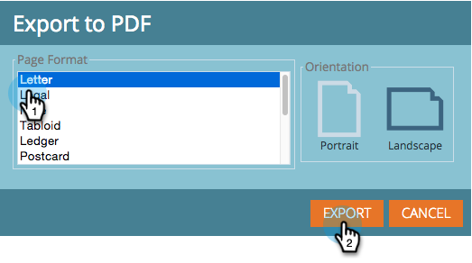

# 匯出收入總管報表{#exporting-a-revenue-explorer-report}

您可以匯出任何收入總管報表，並與任何人共用。

1. 按一下「齒輪」(Gear)表徵圖，選擇「**導出**」並選擇檔案格式。

   

   >[!NOTE]
   >
   >您可以將報表匯出為下列三種格式：
   >
   >* PDF
   >* Excel
   >* CSV

1. 選擇所需的&#x200B;**頁面格式**&#x200B;和&#x200B;**方向**，然後按一下&#x200B;**導出**。

   

   真貼心！ 使用您像忍者一樣的行銷技巧，將此檔案傳送給同儕，讓同儕留下深刻印象。

>[!MORELIKETHIS]
>
>[訂閱收入總管報表](/help/marketo/product-docs/reporting/revenue-cycle-analytics/revenue-explorer/subscribe-to-a-revenue-explorer-report.md)
