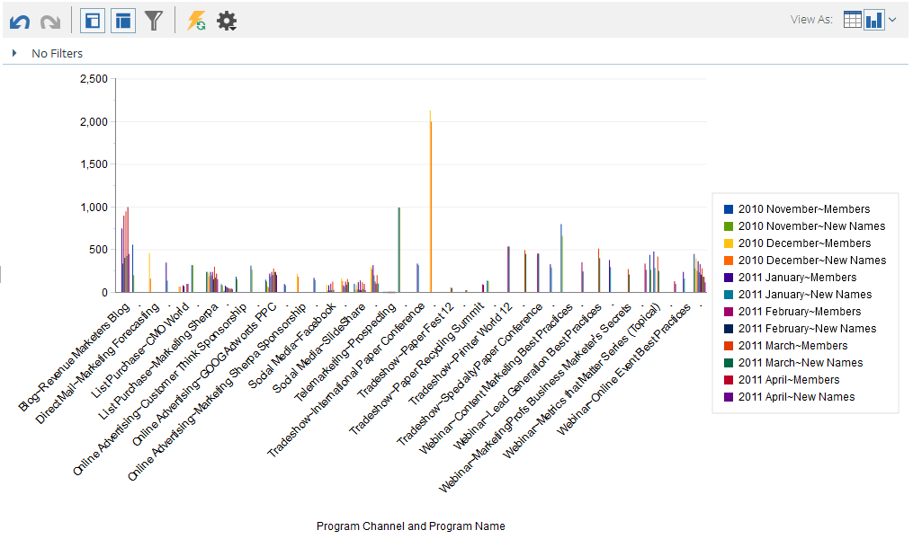

# 從收入總管繪製結果 {#graphing-results-from-revenue-explorer}

根據預設，收入總管中的報表會顯示為表格。 您也可以選擇以各種格式將結果顯示為圖表。

1. 按一下 **檢視方式** 報告的下拉式功能表。 將顯示不同的繪圖選項。

   

## 圖表範例 {#graph-examples}

**欄**：表格中的每一列和每一欄都會顯示為垂直欄。

**棧疊式直條圖**：表格的每一列在圖形中都會有一欄。

**100%棧疊直條圖**：表格中的每一列在圖形中都會有一欄，且會縮放至100%。

**折線圖**：每欄顯示為一行，每列則顯示為一行上的資料點。

**欄 — 行下拉式方塊**：直條圖和折線圖的組合。

**長條圖**：表格中的每一列和每一欄都會顯示為水準條。

**棧疊長條圖**：表格的每一列在圖形中都會有一列。

**100%棧疊長條圖**：表格中的每一列在圖形中都會有一列，且會縮放至100%。

**區域**：資料的顯示方式與棧疊長條圖類似，但以填入顯示。

**圓形圖**：每欄會顯示為圓餅圖，每列則顯示為切片。

**散射環**：代表分割中屬性的放射狀圖形。

**散佈圖**：泡泡根據使用的屬性。 使用測量對泡泡進行色彩編碼和/或決定其大小。

**熱格線**：自訂顏色和形狀以識別正面和負面效能模式。

1. 若要切換回表格檢視，請按一下表格按鈕。

   
