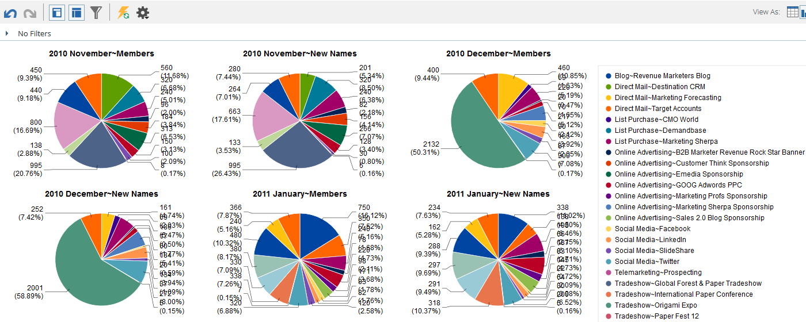

# 從收入瀏覽器{#graphing-results-from-revenue-explorer}繪製結果

依預設，「收入總管」中的報表會顯示為表格。 您也可以選擇以各種格式將結果顯示為圖形。

1. 按一下報表的&#x200B;**檢視方式**&#x200B;下拉式功能表中的箭頭。 將顯示不同的圖形選項。

   

## 圖表範例{#graph-examples}

**欄**:表中的每一行和列都顯示為垂直列。

**堆疊欄**:表格中的每一行在圖形中都有一列。

**100%堆疊欄**:表格中的每一行在圖形中都有一欄，並會縮放為100%。

**行**:每一欄會顯示為一行，而每一列會顯示為行上的資料點。

**欄行組合**:「列」和「折線」圖的組合。

**欄**:表格中的每一行和一列都顯示為水準條。

**堆疊列**:表格中的每一行在圖形中都有一行。

**100%堆疊長條**:表格中的每一行在圖形中都有一行，並會縮放為100%。

**區域**:資料的顯示方式類似堆疊列，但已填入。

**派**:每列都顯示為圓形圖，每行都顯示為切片。

**散射環**:在切片中表示屬性的徑向圖。

**散布**:泡泡是根據使用的屬性。使用測量對氣泡進行顏色編碼和／或確定其大小。

**熱網格**:自訂顏色和形狀，以識別正面和負面的效能模式。

1. 要切換回表視圖，請按一下表按鈕。

   
