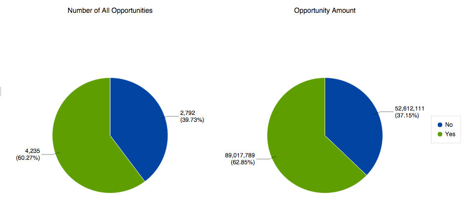
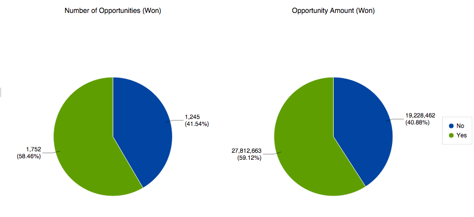

# 了解Revenue Explorer中的Opportunity Analysis {#understanding-opportunity-analysis-in-revenue-explorer}

「收入總管」中的「機會分析」允許您更深入地檢查您的機會。 根據任何銷售機會/公司屬性（例如銷售機會來源、產業或地理位置）分割資料。 根據名稱、階段或概率分析機會的建立和關閉。 了解對管道的行銷貢獻。

## 範例分析 {#example-analysis}

以下是可以在「機會分析」區域中建立的一些報告。

1. 行銷對已建立機會的影響

   您公司的銷售管道中，有多少百分比受到行銷計畫的影響？ 這份報告給你答案。 下面的餅圖顯示了由市場營銷計畫獲取的所有機會數量的百分比和機會數量。

   

1. 行銷對機會的影響已關閉且成功。

   此報表依數量和金額顯示有多少收入受到行銷的影響。

   

1. 按銷售機會來源結束的業務機會

   此報告按銷售機會來源劃分所有關閉的銷售機會，並為您提供有效來源和無效來源的明確概覽。

   

1. 按源關閉時間

   此報告演示了關閉機會的平均天數與銷售機會來源之間的關係。

   

1. 開放機會和階段

   此報表顯示每個收入週期階段中有多少機會處於開啟狀態。

   

1. 按行業分列的機會數

   這份報告回答的問題是，「我們從某些行業獲得的機會是否逐年減少？」

   

## 機會分析Dimension和措施 {#opportunity-analysis-dimensions-and-measures}

Opportunity Analysis允許您訪問所有與銷售機會、公司和銷售機會相關的維度以及與銷售機會相關的度量。 使用這些機會分析維度和度量來回答報告中的特定問題。

1. 公司屬性

   | 維度 | 說明 |
   |---|---|
   | 年收入 | 公司的年收入 |
   | 城市 | 公司所在的城市 |
   | 國家 | 公司所在的縣 |
   | 產業 | 公司所處的行業 |
   | 公司名稱 | 公司名稱 |
   | 員工人數 | 公司僱員人數 |
   | 郵遞區號 | 公司郵遞區號 |
   | SIC 代碼 | 公司SIC代碼 |
   | 州別 | 公司所在的州 |

1. 銷售機會屬性

   | 維度 | 說明 |
   |---|---|
   | 已列入封鎖名單 | 銷售機會被列入封鎖名單 |
   | 轉換為Opportunity | 銷售機會被轉換為銷售機會 |
   | 電子郵件無效 | 銷售機會是否具有有效的電子郵件地址 |
   | 行銷活動已暫停 | 銷售機會是否從行銷電子郵件中暫停 |
   | 電子郵件地址 | Lead的電子郵件地址 |
   | 職稱 | Lead的職務 |
   | 全名 | 領導的全名 |
   | 原始源類型 | 銷售線索的原始源類型 |
   | 註冊源類型 | Lead的註冊源類型 |
   | 銷售機會擁有者電子郵件地址 | 潛在客戶所有者的電子郵件地址 |
   | 銷售機會所有者職務 | 潛在客戶所有者的職務 |
   | 銷售機會所有者名稱 | 潛在客戶所有者名稱 |
   | 銷售機會來源 | 潛在客戶來源 |
   | 銷售機會狀態 | 銷售機會狀態 |

1. 銷售機會建立時間範圍

   | 維度 | 說明 |
   |---|---|
   | 銷售機會建立年份 | 銷售機會建立的年份 |
   | 銷售機會建立季度 | 銷售機會建立時的季度 |
   | 銷售機會建立月份 | 建立銷售機會的月份 |
   | 銷售機會建立周 | 建立銷售機會的周 |
   | 銷售機會建立日期 | 銷售機會的建立日期 |

1. 機會屬性

   | 維度 | 說明 |
   |---|---|
   | 業務機會已關閉 | 機會是否已結束 |
   | 機會預測類別 | 機會預測類別 |
   | 機會名稱 | 機會名稱 |
   | 機會階段 | 機會階段 |
   | 機會類型 | 機會類型 |
   | 機會贏 | 這個機會是否已經結束，並且贏了 |
   | 行銷影響的機會 | 此旗標指出是否有任何銷售機會/聯絡人是由任何行銷計畫取得或取得成功。 只考慮具有定期成本的方案。 |

1. 業務機會結束時間範圍

   | 維度 | 說明 |
   |---|---|
   | 已結業年 | 機會結束的年份 |
   | 業務機會已結季度 | 機會關閉的季度 |
   | 銷售機會結束月份 | 機會關閉的月份 |
   | 銷售機會結束周 | 機會關閉的那周 |
   | 業務機會結束日期 | 業務機會的結束日期 |

1. 業務機會建立的時間範圍

   | 維度 | 說明 |
   |---|---|
   | 業務機會建立年 | 建立業務機會的年份 |
   | 業務機會建立的季度 | 建立業務機會的季度 |
   | 業務機會建立月份 | 建立業務機會的月份 |
   | 建立的銷售機會周 | 建立業務機會的周 |
   | 業務機會建立日期 | 建立業務機會的日期 |

1. 測量值

   | 測量 | 說明 |
   |---|---|
   | 結束機會的平均天數 | 關閉機會的平均天數 |
   | 關閉機會的平均天數（丟失） | 丟失機會的平均天數 |
   | 關閉機會的平均天數（韓元） | 成功機會的平均天數 |
   | 所有機會數 | 所有機會的總數 |
   | 機會數（已關閉） | 已關閉的機會總數（勝負） |
   | 機會數（丟失） | 丟失的機會總數 |
   | 機會數（未結） | 仍在開啟的機會總數 |
   | 機會數（韓元） | 贏得的機會總數 |
   | 機會金額 | 總機會金額。 如果與一個業務機會關聯了多個銷售機會，則分配金額將基於銷售機會分數。 |
   | 機會金額（丟失） | 損失的機會的總金額。 如果與一個業務機會關聯了多個銷售機會，則分配金額將基於銷售機會分數。 |
   | 機會金額（未結） | 未結業務機會的總金額。 如果與一個業務機會關聯了多個銷售機會，則分配金額將基於銷售機會分數。 |
   | 機會金額（韓元） | 成功機會的總金額。 如果與一個業務機會關聯了多個銷售機會，則分配金額將基於銷售機會分數。 |

>[!MORELIKETHIS]
>
>* [建立收入總管報表](/help/marketo/product-docs/reporting/revenue-cycle-analytics/revenue-explorer/create-a-revenue-explorer-report.md)
>* [新增欄位至收入總管報表](/help/marketo/product-docs/reporting/revenue-cycle-analytics/revenue-explorer/adding-fields-to-a-revenue-explorer-report.md)
>* [訂閱收入總管報表](/help/marketo/product-docs/reporting/revenue-cycle-analytics/revenue-explorer/subscribe-to-a-revenue-explorer-report.md)

