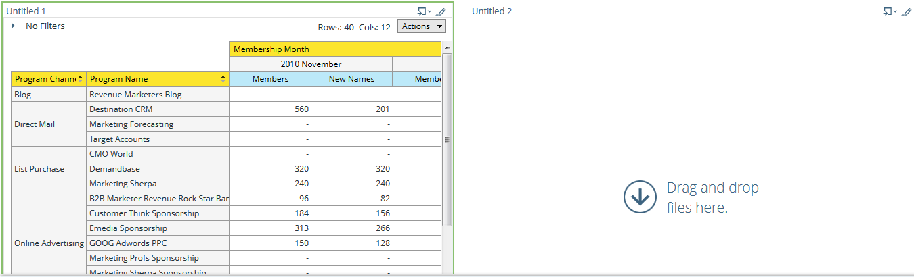
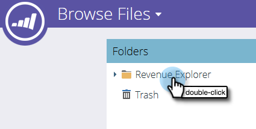

# 在Revenue Explorer中使用控制面板 {#using-dashboards-in-revenue-explorer}

控制面板是Revenue Explorer報表的組合，可快速概覽您的銷售機會、行銷活動、機會和/或模型。

## 建立新控制面板 {#creating-a-new-dashboard}

1. 按一下 **收入總管**.

   

1. 按一下 **新建**，則 **儀表板**.

   

1. 在頁面底部，預設會選取範本。 按一下您要使用的版面。 此處使用「2欄」。

   

   >[!NOTE]
   >
   >您可以按一下「 」，進一步自訂您的儀表板外觀 **主題** 並挑選您最愛的。

1. 在控制面板的第一個區段中，按一下 **插入** 圖示並選取 **檔案**.

   

1. 按兩下 **收入總管**.

   

1. 按兩下 **所有報告和儀表板**.

   

1. 連按兩下存放您要使用之報告的資料夾。

   

1. 選擇您的報告並按一下 **選取**.

   

1. 然後報表會填入。 對每個剩餘截面重複步驟4-8。

   

1. 若要重新命名區段，請按一下以選取該區段，在「標題」下輸入所要的名稱，然後按一下 **套用**. 對每個區段重複此步驟。

   

1. 若要儲存，請按一下「儲存」圖示、輸入檔案名稱、連按兩下「收入總管」資料夾，直到您進入想要的資料夾儀表板為止，然後按一下 **儲存**.

   

## 編輯控制面板 {#editing-a-dashboard}

1. 按一下 **收入總管**.

   

1. 連按兩下 **收入總管** 資料夾。 導覽至您的儀表板所在位置。

   

1. 選取您要編輯的控制面板，然後按一下 **編輯**.

   

## 刪除控制面板 {#deleting-a-dashboard}

1. 按一下 **收入總管**.

   

1. 連按兩下 **收入總管** 資料夾。 導覽至您的儀表板所在位置。

   

1. 選取您要刪除的控制面板，然後按一下 **移至垃圾桶**.

   
