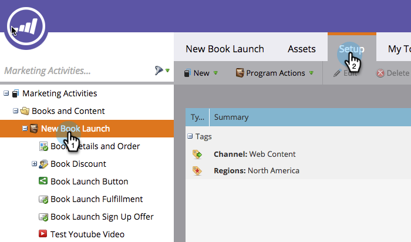
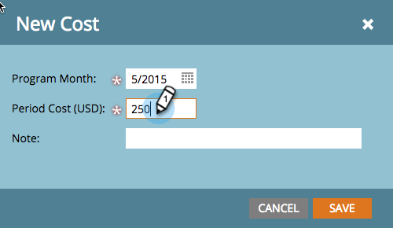

# 定義期間成本 {#define-period-costs}

>[!NOTE]
>
>**定義**
>
>期間成本是您在計畫上花費的金額。 可持續一個或多個月，用於報告ROI。

通過定義銷售線索的成本承擔時間和地點來跟蹤並關聯銷售線索培訓和銷售線索獲取成本的方案或事件。

>[!NOTE]
>
>在方案的開頭，輸入預測成本。 在程式中的期間完成後，您可以編輯期間成本並輸入實際成本。 這可提供您準確的報表結果。

## 定義期間成本 {#define-a-period-cost}

1. 存取 **設定** 頁簽。

   

1. 拖放 **期間成本** 到畫布和 **新成本** 對話框。

   

1. 輸入 **計畫月份** 要與定義的成本關聯。

   

1. 輸入 **期間成本** 整數，不含小數或逗號(上限：99999999)

   

   >[!NOTE]
   >
   >貨幣（例如美元、歐元等） 是由Marketo管理員管理的全域設定

1. 輸入描述性 **附註** （可選），然後按一下 **儲存**.

   

## 編輯期間成本 {#edit-a-period-cost}

1. 按一下右鍵期間成本並選擇 **編輯** 從快顯功能表開啟 **編輯成本** 對話框。

   

1. 視需要編輯期間成本

   

## 刪除期間成本 {#delete-a-period-cost}

1. 按一下右鍵要刪除的期間成本，然後選擇 **刪除** 顯示 **刪除成本** 提示。

   

1. 按一下 **刪除** 永久刪除期間成本，或 **取消** 回去。

   
