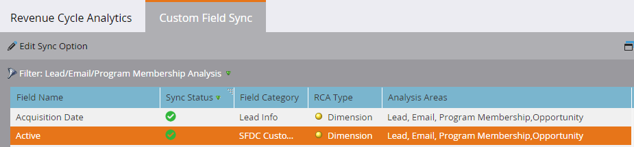

# 啟用收入週期分析的自訂欄位同步 {#enabling-custom-field-sync-for-revenue-cycle-analytics}

下列步驟可讓您利用RCA報表中的自訂欄位。

1. 按一下 **管理**.

   

1. 按一下 **收入週期分析**，然後 **自訂欄位同步**.

   

1. 選取 **欄位名稱**，然後按一下 **編輯同步選項**.

   

1. 在同步狀態下，選擇 **已啟用**，然後按一下 **儲存**.

   

1. 綠色檢查可讓您知道欄位已設定為同步。

   

   就這樣！

   >[!NOTE]
   >
   >欄位啟用後，資料將於隔天於收入週期分析中使用。
