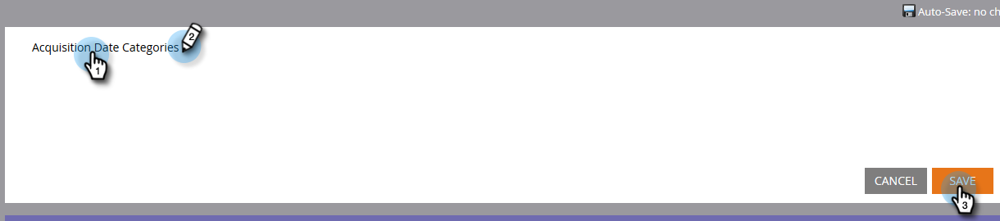

# 使用欄位管理器{#create-custom-field-groups-using-the-field-organizer}建立自訂欄位群組

在「收入週期瀏覽器」的「模型效能分析（銷售機會）區域」中啟用報告的自定義欄位組之前，您必須將標準或自定義欄位分為組，以便通過Marketo Lead Management中的「欄位管理器」進行報告。 這僅適用於銷售線索和公司屬性。
當您從「新建欄位管理器」對話框的「欄位」下拉式頁籤中選擇標準或自定義欄位時，系統會將與要與欄位關聯的「Marketto Lead Management」資料類型與「欄位管理器」中的三個可用編輯器之一對應：字串、整數或日期。

| Marketo銷售線索管理資料類型 | 欄位管理器編輯器資料類型 |
|---|---|
| 字串 | 字串 |
| 電子郵件 | 字串 |
| 整數 | 整數 |
| 文字 | 字串 |
| URL | 字串 |
| 參考 | 不支援 |
| 貨幣 | 整數 |
| DateTime | 日期 |
| 布林值 | 不支援 |
| 電話 | 字串 |
| 日期 | 日期 |
| 浮點 | 整數 |
| 計算 | 不支援 |

接下來的三節將說明如何建立字串、整數或日期類型的自訂欄位群組。

## 建立自訂欄位群組——字串編輯器{#create-custom-field-group-string-editor}

1. 按一下&#x200B;**Lead Database**。

   

1. 按一下&#x200B;**新建** ，然後選擇&#x200B;**新建欄位管理器**。

   

1. 按一下「**欄位**」，並選取標準或自訂欄位，其資料類型會對應至字串編輯器（請參閱上一節的表格）。 這裡使用國家。

   

1. 按一下&#x200B;**建立**。

   

   新的自定義組顯示在「銷售線索資料庫」樹中，表示為「欄位名稱」>「欄位名稱組」(示例：國家>國家／地區群組)。

   

1. 按一下鉛筆圖示可自訂名稱。 例如，您可將「國家／地區群組」重新命名為「Continent」。 輸入所要的新名稱，然後按一下離開方塊即可自動儲存。

   

1. 依預設，所有資料值都會放在「其他」子群組中。 若要將資料值分類，請按一下「新增群組」以建立子群組並為其指定名稱。****

   >[!NOTE]
   >
   >您最多可以新增10個子群組來分類資料值。 所建立的每個子群組都會指派一個ID號碼。

   在此範例中，已針對大部分大陸建立群組。

   

   >[!NOTE]
   >
   >若要刪除子群組，只需按一下子群組名稱旁的紅色X即可。 如果組中有任何資料值，則資料值將移至預設的「其他」組。

1. 在畫布中反白標示資料值，並將資料值拖放至適當的子群組。

   

   >[!NOTE]
   >
   >要從子組中刪除資料值，請將資料值重新指派給預設組「其他」。

1. 使用畫布正上方的左上角的篩選選項，選取並檢視一或多個子群組中的資料值。 畫布中會顯示根據篩選選擇的資料值。

   

   >[!NOTE]
   >
   >定義群組後，您可以透過Marketo Lead Management中的「收入週期分析」標籤，在Model Performance Analysis(Leads)中啟用自訂欄位群組以進行報告。

## 建立自訂欄位群組——整數編輯器{#create-custom-field-group-integer-editor}

1. 按一下&#x200B;**Lead Database**。

   

1. 按一下&#x200B;**新建** ，然後選擇&#x200B;**新建欄位管理器**。

   

1. 按一下「**欄位**」，並選取標準或自訂欄位，其資料類型會對應至字串編輯器（請參閱上一節的表格）。 此處使用年度收入。

   

1. 按一下&#x200B;**建立**。

   

   新的自定義組顯示在「銷售線索資料庫」樹中，表示為「欄位名稱」>「欄位名稱組」(示例：年度收入>年度收入群組)。

   

1. 按一下整數編輯器上方的預設自訂群組名稱，以自訂名稱。 例如，您可將「年度收入群組」重新命名為「依規模劃分的年度收入」。 按一下&#x200B;**保存**。

   

   整數編輯器允許您建立多個子組，以按大小定義每個子組。 在此範例中，將為中小型企業建立三個群組。

1. 要添加第一個組，請在&#x200B;**組名**&#x200B;欄位中輸入一個名稱(例如：小)，並在&#x200B;**群組範圍**&#x200B;欄位中輸入最大值(例如：200000)。 按一下&#x200B;**添加組**。

   

   剛輸入的群組下方會顯示空白的群組項目。 以下範例顯示「中小型企業」和「企業」的項目。

   >[!NOTE]
   >
   >您最多可以新增10個子群組來分類資料值。 每個「群組範圍」項目都建立在上一個項目之上。 如果您為最後建立的自訂子群組保留最後一個「群組範圍」項目空白，則不會設定最大資料值。

1. 按一下「摘要」標籤，儲存並檢視您的設定。

   

   >[!NOTE]
   >
   >若要刪除子群組，請按一下子群組名稱旁的紅色X。

1. 在「摘要」頁面上，檢閱您的設定。

   

   >[!NOTE]
   >
   >定義群組後，您可以透過Marketo Lead Management中的「收入週期分析」標籤，在Model Performance Analysis(Leads)中啟用自訂欄位群組以進行報告。

## 建立自訂欄位群組——日期編輯器{#create-custom-field-group-date-editor}

1. 按一下&#x200B;**Lead Database**。

   

1. 按一下&#x200B;**新建** ，然後選擇&#x200B;**新建欄位管理器**。

   

1. 按一下「**欄位**」，並選取標準或自訂欄位，其資料類型會對應至字串編輯器（請參閱上一節的表格）。 此處使用贏取日期。

   

1. 按一下&#x200B;**建立**。

   

   新的自定義組顯示在「銷售線索資料庫」樹中，表示為「欄位名稱」>「欄位名稱組」(示例：收購日期>收購日期集團)。

   

1. 按一下日期編輯器上方的預設自訂群組名稱，以自訂名稱。 例如，您可將「贏取日期群組」重新命名為「贏取日期類別」。 按一下&#x200B;**保存**。

   

   日期編輯器可讓您建立多個子群組，並依日期定義每個子群組。 在此範例中，將建立三個群組：Q1-15 Leads 、 Q2-15 Leads和Q3-15 Leads。

1. 要添加第一個組，請在&#x200B;**組名**&#x200B;欄位中輸入一個名稱(例如：Q1-15 Leads)，並在日期欄位中輸入一個日期，該日期表示銷售線索在或之前獲得的日期(例如：2015/3/31)。 按一下&#x200B;**添加組**。

   

   >[!NOTE]
   >
   >您最多可以新增10個子群組來分類資料值。 每個「群組範圍」項目都建立在上一個項目之上。 如果您為最後建立的自訂子群組保留最後一個「群組範圍」項目空白，則不會設定結束日期值。

   以下範例顯示2015年第1季到第3季的銷售機會項目。

   

   就這樣！ 幹得好。
