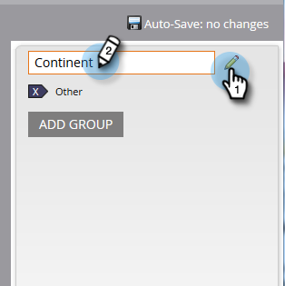

# 使用「欄位組織器」建立自訂欄位群組 {#create-custom-field-groups-using-the-field-organizer}

在啟用自訂欄位群組以在「收入週期總管」的「模型效能分析（銷售機會）」區域中報告之前，您必須透過「Marketo銷售機會管理」中的「欄位組織器」，將標準或自訂欄位分類為群組以便報告。 這僅適用於潛在客戶與公司屬性。
當您從「新增欄位組織器」對話方塊的「欄位」下拉式清單中選取標準或自訂欄位時，系統會對應與您要群組之欄位相關的「Marketo銷售機會管理」資料型別，並在「欄位組織器」中選取三個可用編輯器的其中之一：字串、整數或日期。

| Marketo銷售機會管理資料型別 | 欄位組織器編輯器資料型別 |
|---|---|
| 字串 | 字串 |
| 電子郵件 | 字串 |
| 整數 | 整數 |
| 文字 | 字串 |
| URL | 字串 |
| 參考 | 不支援 |
| 貨幣 | 整數 |
| 日期時間 | 日期 |
| 布林值 | 不支援 |
| 電話 | 字串 |
| 日期 | 日期 |
| 浮點數 | 整數 |
| 已計算 | 不支援 |

接下來的三節將說明如何為字串、整數或日期型別建立自訂欄位群組。

## 建立自訂欄位群組 — 字串編輯器 {#create-custom-field-group-string-editor}

1. 按一下 **潛在客戶資料庫**.

   

1. 按一下 **新增**，並選取 **新增欄位組織器**.

   

1. 按一下 **欄位** ，並選取具有對應至字串編輯器之資料型別的標準或自訂欄位（請參閱上一節中的表格）。 此處使用國家/地區。

   

1. 按一下 **建立**。

   

   新的自訂群組會顯示在「潛在客戶資料庫」樹狀結構中，表示為「欄位名稱」>「欄位名稱群組」（範例：國家/地區>國家/地區群組）。

   

1. 按一下鉛筆圖示可自訂名稱。 例如，您可以將「國家群組」重新命名為「大陸」。 輸入所需的新名稱，然後按一下離開方塊以自動儲存。

   

1. 依預設，所有資料值都會放在「其他」子群組中。 若要分類資料值，請按一下 **新增群組** 建立子群組並為其命名。

   >[!NOTE]
   >
   >您可以新增最多10個子群組來分類資料值。 每個建立的子群組都會獲派一個ID號碼。

   在此範例中，群組已針對大部分大陸建立。

   

   >[!NOTE]
   >
   >若要刪除子群組，只要按一下子群組名稱旁邊的紅色X即可。 如果群組中有任何資料值，資料值將會移至「其他」的預設群組。

1. 反白顯示畫布中的資料值，並將資料值拖放至適當的子群組中。

   

   >[!NOTE]
   >
   >若要從子群組中移除資料值，請將資料值重新指派給「其他」的預設群組。

1. 使用畫布正上方左上角的篩選選項，選取並檢視一或多個子群組中的資料值。 根據您篩選器選擇的資料值會顯示在畫布中。

   

   >[!NOTE]
   >
   >定義群組後，您可以透過Marketo銷售機會管理中的收入週期Analytics索引標籤，啟用自訂欄位群組，以便在模型績效分析（銷售機會）中報告。

## 建立自訂欄位群組 — 整數編輯器 {#create-custom-field-group-integer-editor}

1. 按一下 **潛在客戶資料庫**.

   

1. 按一下 **新增**，並選取 **新增欄位組織器**.

   

1. 按一下 **欄位** ，並選取具有對應至字串編輯器之資料型別的標準或自訂欄位（請參閱上一節中的表格）。 年度收入在此使用。

   

1. 按一下 **建立**。

   

   新的自訂群組會顯示在「潛在客戶資料庫」樹狀結構中，表示為「欄位名稱>欄位名稱群組」（範例：年度收入>年度收入群組）。

   

1. 按一下整數編輯器上方的預設自訂群組名稱，以自訂名稱。 例如，您可以將「年度收入群組」重新命名為「依大小的年度收入」。 按一下 **儲存**.

   

   整數編輯器可讓您建立多個子群組，依大小定義每個子群組。 在此範例中，將會為小型、中型及企業建立三個群組。

1. 若要新增您的第一個群組，請在 **群組名稱** 欄位（例如：小），並在 **群組範圍** 欄位(範例： 200000)。 按一下 **新增群組**.

   

   在剛輸入的群組下方會顯示空白的群組專案。 以下範例顯示適用於小型、中型及企業企業的專案。

   >[!NOTE]
   >
   >您可以新增最多10個子群組來分類資料值。 每個「群組範圍」專案都建立在上一個專案上。 如果您將您建立的最後一個自訂子群組的最後一個群組範圍專案保留空白，則不會設定最大資料值。

1. 按一下「摘要」標籤以儲存並檢閱您的設定。

   

   >[!NOTE]
   >
   >若要刪除子群組，請按一下子群組名稱旁邊的紅色X。

1. 在「摘要」頁面上，檢閱您的設定。

   

   >[!NOTE]
   >
   >定義群組後，您可以透過Marketo銷售機會管理中的收入週期Analytics索引標籤，啟用自訂欄位群組，以便在模型績效分析（銷售機會）中報告。

## 建立自訂欄位群組 — 日期編輯器 {#create-custom-field-group-date-editor}

1. 按一下 **潛在客戶資料庫**.

   

1. 按一下 **新增**，並選取 **新增欄位組織器**.

   

1. 按一下 **欄位** ，並選取具有對應至字串編輯器之資料型別的標準或自訂欄位（請參閱上一節中的表格）。 贏取日期在此使用。

   

1. 按一下 **建立**。

   

   新的自訂群組會顯示在「潛在客戶資料庫」樹狀結構中，表示為「欄位名稱>欄位名稱群組」（範例：贏取日期>贏取日期群組）。

   

1. 按一下日期編輯器上方的預設自訂群組名稱以自訂名稱。 例如，您可以將「贏取日期群組」重新命名為「贏取日期類別」。 按一下 **儲存**.

   

   日期編輯器可讓您建立多個子群組，並按日期定義每個子群組。 在此範例中，將建立三個群組：Q1-15銷售機會、Q2-15銷售機會和Q3-15銷售機會。

1. 若要新增您的第一個群組，請在 **群組名稱** 欄位（範例：Q1-15銷售機會），並在「日期」欄位中輸入日期，代表取得銷售機會的日期或之前的日期（例如：Q1-15最後一天的日期：3/31/2015）。 按一下 **新增群組**.

   

   >[!NOTE]
   >
   >您可以新增最多10個子群組來分類資料值。 每個「群組範圍」專案都建立在上一個專案上。 如果您將您建立的最後一個自訂子群組的最後一個群組範圍專案保留空白，則不會設定結束日期值。

   以下範例顯示2015年第1季到第3季的銷售線索專案。

   

   就是這樣！ 做得好。
