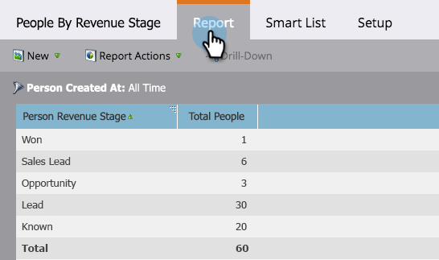

# 按收入階段列出的人員報告 {#people-by-revenue-stage-report}

您可以建立報表，顯示您的人員所在的收入週期模型的哪個階段。 只要報表的指定日期範圍記憶體在人員餘額，報表就會包括指定模型中的任何階段。

>[!AVAILABILITY]
>
>並非所有Marketo版本都包含此功能。 如需詳細資訊，請連絡您的客戶經理。

1. 前往 **Analytics**.

   

1. 按一下報表 **各收入階段人員**.

   

1. 按一下 **設定** 標籤。 按兩下 **建立於** 欄位來設定要報告的所需時間範圍。

   

1. 編輯時間範圍並按一下 **儲存**.

   

1. 按一下 **報表** 標籤。 現在，您可以了解您的員工所處的收入模型的哪個階段，並專注於任何瓶頸。

   
