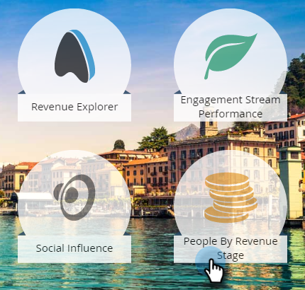

# 依收入階段區分的人員報表 {#people-by-revenue-stage-report}

您可以建立報表，顯示您的人員處於收入週期模型的哪個階段。 只要報表的指定日期範圍有人員餘額，報表就會包含指定模型中的任何階段。

>[!AVAILABILITY]
>
>並非所有Marketo版本都包含此功能。 如需詳細資訊，請聯絡您的客戶經理。

1. 前往 **分析**.

   

1. 按一下報表 **依收入階段區分的人員**.

   

1. 按一下 **設定** 標籤。 連按兩下 **個人建立時間** 欄位以設定報告所需的時間範圍。

   

1. 編輯時間範圍並按一下 **儲存**.

   

1. 按一下 **報告** 標籤。 現在，您可以檢視人員處於收入模式的哪個階段，並專注於任何瓶頸。

   
