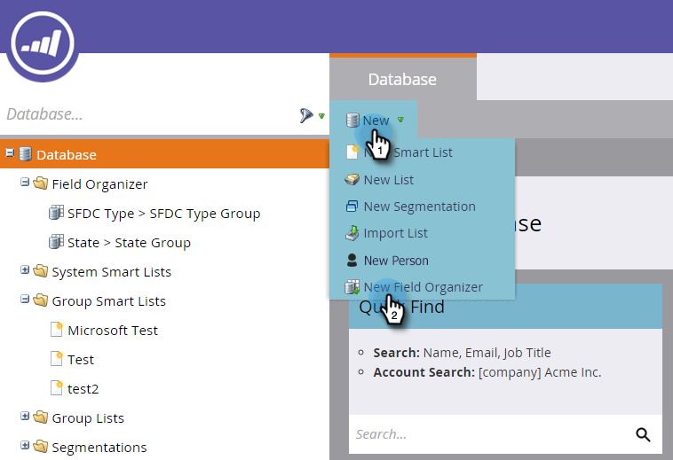

# 使用現場組織者 {#using-field-organizers}

欄位組織者可協助您指定所有可能值中的特定欄位。 例如，您可以為「領土」欄位建立有意義的分組，例如「西海岸」和「東海岸」。 這可協助報表更快速執行。

外地組織者與一般使用的細分類似，但外地組織者用於外地一級的報告。

欄位清單中最多可以有三個自訂區段。

沒有具體的現場組織者報告。

現場組織者用於模型效能分析。

## 如何建立現場組織者 {#how-to-create-field-organizers}

1. 按一下 **資料庫**.

   

1. 在 **新增**，選取 **新建欄位管理器**.

   

1. 在 **欄位**，請選取屬性。 說明為選用。

   

1. 按一下 **建立**。

   

1. 為群組命名並輸入適當資料（這取決於所選欄位的資料類型）。 按一下 **新增群組**.

   

如果您需要，請以相同的方式建立更多現場組織者。 你在這。

>[!MORELIKETHIS]
>
>[使用「欄位管理器」建立自訂欄位群組](/help/marketo/product-docs/reporting/revenue-cycle-analytics/revenue-tools/field-organizers/create-custom-field-groups-using-the-field-organizer.md)
