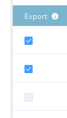

# 帳戶分析排名和優化{#account-profiling-ranking-and-tuning}

「帳戶分析」可識別您的「理想客戶配置檔案」(ICP)，根據ICP對資料庫中的公司進行排名，並將ICP指標資料添加到提升為「命名帳戶」的帳戶。

## 型號結果{#model-results}

結果會顯示您所有已知帳戶，依等級劃分。 A是最高等級，D是最低等級。

雖然是選用的，但建議選取「自動升級」核取方塊，因為它可為您節省大量時間。 不過，如果您想要逐一檢視每個帳戶，並手動新增[，只需將方塊保留為未勾選。](/help/marketo/product-docs/target-account-management/target/named-accounts/discover-accounts.md#discover-crm-accounts)

<table> 
 <tbody> 
  <tr> 
   <td><strong>排名</strong></td> 
   <td> 
    

      根據理想客戶個人檔案的帳戶排名。 A最合適，D最不適合。 
    
</td> 
  </tr> 
  <tr> 
   <td><strong>傾向</strong></td> 
   <td> 
    

      與非基於比較方案的賬戶選擇相比，轉換率的估計增加。 
    
</td> 
  </tr> 
  <tr> 
   <td><strong>帳戶(%)</strong></td> 
   <td> 
    

      具有此排名的模型輸入帳戶百分比。 
    
</td> 
  </tr> 
  <tr> 
   <td><strong>模型基礎的%</strong></td> 
   <td> 
    

      具有此排名的模型基礎帳戶百分比。 
    
</td> 
  </tr> 
 </tbody> 
</table>

## 模型調整{#model-tuning}

在「模型」(Model)頁籤中，按一下「調整模型」(Tune Model)按鈕。

有數個標籤可供選擇，可進行深度自訂。

**指標類別**

<table> 
 <tbody> 
  <tr> 
   <td><strong>符合性</strong></td> 
   <td> 
    

      認證、合規性相關職位／雇用。 
    
</td> 
  </tr> 
  <tr> 
   <td><strong>操作</strong></td> 
   <td> 
    

      與業務相關的職位／聘用。 
    
</td> 
  </tr> 
  <tr> 
   <td><strong>HR</strong></td> 
   <td> 
    

      HR或工資單軟體、與HR相關的職位／聘用。
    
</td> 
  </tr> 
  <tr> 
   <td><strong>工程</strong></td> 
   <td> 
    

      技術、框架、與工程相關的職位／雇用。 
    
</td> 
  </tr> 
  <tr> 
   <td><strong>銷售</strong></td> 
   <td> 
    

      銷售、銷售相關職位／招聘的解決方案和軟體。 
    
</td> 
  </tr> 
  <tr> 
   <td><strong>意圖</strong></td> 
   <td> 
    

      意圖指標。 
    
</td> 
  </tr> 
  <tr> 
   <td><strong>IT</strong></td> 
   <td> 
    

      硬體和軟體解決方案、技術、IT相關職位／雇用。
    
</td> 
  </tr> 
  <tr> 
   <td><strong>金融</strong></td> 
   <td> 
    

      財務軟體、財務相關職位／雇用。 
    
</td> 
  </tr> 
  <tr> 
   <td><strong>行銷</strong></td> 
   <td> 
    

      行銷技術和軟體、行銷相關職位／雇用。 
    
</td> 
  </tr> 
  <tr> 
   <td><strong>企業</strong></td> 
   <td> 
    

      福布斯或Inc公司的上市或商業夥伴關係。 
    
</td> 
  </tr> 
  <tr> 
   <td><strong>客戶體驗與關係</strong></td> 
   <td> 
    

      客戶成功與客戶關係職位／雇用。
    
</td> 
  </tr> 
 </tbody> 
</table>

將滑鼠指標暫留在工具提示上，以取得每欄的說明。

按一下「添加ICP指示器」(Add ICP Indicator)下拉式清單，將其他指示器插入模型。

選中「導出」框可以在「命名帳戶詳細資訊」頁上查看ICP指示符，並在[命名帳戶篩選器](/help/marketo/product-docs/target-account-management/engage/account-filters.md)中將選定的ICP指示符用作約束。

>[!NOTE]
>
>ICP指示符在&#x200B;**命名帳戶成員**&#x200B;篩選器和觸發器中作為約束包含。

指標權重是控制每個指標在模型中所接受的重要程度的指標。

按一下「刷新模型」(Refresh Model)，這些更改才會生效。

完成模型調整（刷新模型後）後，返回「模型結果」頁籤，然後按一下&#x200B;**保存並應用排名**。

