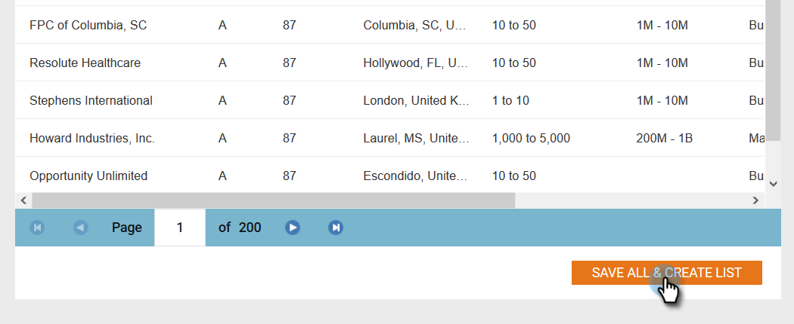

# 新帳戶發現{#new-account-discovery}

新帳戶探索可協助您使用理想客戶個人檔案中由人工智慧提供的建議，來尋找要鎖定的新帳戶。

>[!PREREQUISITES]
>
>[設定帳戶分析](/help/marketo/product-docs/target-account-management/account-profiling/setting-up-account-profiling.md)

>[!TIP]
>
>建議您在執行新帳戶搜尋前，按&#x200B;**更新現有帳戶**&#x200B;按鈕，以確保您正在檢視最新的資料。 此更新最多需要24小時。

1. 在「我的行銷工具」中，按一下&#x200B;**ABM**。

   

1. 按一下&#x200B;**Account Profiling**&#x200B;頁籤。

   

1. 按一下&#x200B;**新帳戶**&#x200B;頁籤。

   

   >[!NOTE]
   >
   >「新帳戶」顯示ABM中尚未包含您帳戶的帳戶清單。 這些帳戶可能會根據您選取的篩選條件而成為新帳戶。

1. 選取所有適用的篩選條件（此部分可高度自訂，以下只是示範篩選的一個範例）。

   

1. 按一下頁面右下角的&#x200B;**全部儲存並建立清單**。

   

   >[!NOTE]
   >
   >如果您只看到一些所需的帳戶，則可以選擇按一下單個帳戶並在完成時按一下&#x200B;**保存選定帳戶**。

1. 您可以將您的清單設為新的帳戶清單，或將清單新增至現有的帳戶清單。 在此範例中，我們將建立新的範例。

   

   >[!NOTE]
   >
   >若要將其儲存至現有的帳戶清單，請選取該選項，按一下下拉式清單並選取所要的帳戶清單，然後按一下&#x200B;**Next**。

1. 按一下&#x200B;**保存**。

   

   >[!NOTE]
   >
   >一次最多只能節省5,000個帳戶。 如果您的搜尋產生10,000個結果，您必須先儲存第一個（最上方）5,000個，然後重設篩選並儲存下一個5,000個。 **總計**&#x200B;帳戶限制為100萬。

1. 按一下&#x200B;**確定**。

   

   >[!TIP]
   >
   >儲存帳戶後，您可以在LinkedIn](/help/marketo/product-docs/target-account-management/target/create-a-matched-audience-on-linkedin.md)上使用[符合的對象來定位他們。
