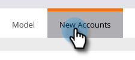

# 新帳戶探索 {#new-account-discovery}

新帳戶探索可協助您使用理想客戶設定檔中的AI支援建議，尋找要鎖定的新帳戶。

>[!IMPORTANT]
>
>自2025年起，新使用者將無法再使用「帳戶分析」。 它將繼續適用於現有使用者。

>[!PREREQUISITES]
>
>[設定帳戶分析](/help/marketo/product-docs/target-account-management/account-profiling/setting-up-account-profiling.md)

>[!TIP]
>
>在執行新帳戶搜尋之前，建議您按下&#x200B;**更新現有帳戶**&#x200B;按鈕，以確保您檢視的是最新的資料。 此更新最多可能需要24小時的時間。

1. 在「我的Marketo」中，按一下&#x200B;**目標帳戶管理**。

   

1. 按一下「**帳戶分析**」標籤。

   

1. 按一下「**新帳戶**」標籤。

   

   >[!NOTE]
   >
   >「新帳戶」會顯示尚未在TAM中屬於您的帳戶清單。 根據您選取的篩選器，這些帳戶可能會成為您的新帳戶。

1. 選取所有適用的篩選器（此部分可高度自訂，以下只是示範篩選的範例）。

   

1. 按一下頁面右下角的&#x200B;**儲存所有專案並建立清單**。

   

   >[!NOTE]
   >
   >如果您只看到幾個您想要的帳戶，您可以選擇按一下個別帳戶，然後在完成時按一下&#x200B;**儲存選取的帳戶**。

1. 您可以建立清單自己的新帳戶清單，或將其新增到現有帳戶清單中。 在此範例中，我們將建立一個新的。

   

   >[!NOTE]
   >
   >若要將其儲存到現有的帳戶清單，請選取該選項，按一下下拉式清單並選取所需的[帳戶清單]，然後按一下[下一步]&#x200B;**&#x200B;**。

1. 按一下&#x200B;**儲存**。

   

   >[!NOTE]
   >
   >您一次最多只能儲存5,000個帳戶。 如果您的搜尋產生10,000個結果，您必須儲存前（前）5,000個結果，然後重設篩選器並儲存後5,000個結果。 **總計**&#x200B;帳戶限製為100萬。

1. 按一下&#x200B;**「確定」**。

   

   >[!TIP]
   >
   >儲存帳戶後，您可以在LinkedIn[&#128279;](/help/marketo/product-docs/target-account-management/target/create-an-account-matched-audience-on-linkedin.md)上使用相符的對象來鎖定這些對象。
