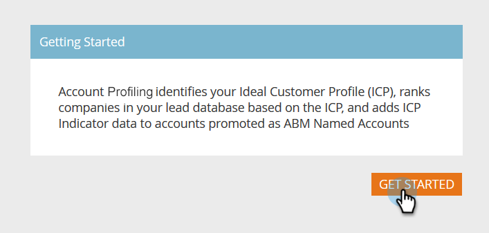

# 設定帳戶分析 {#setting-up-account-profiling}

請依照下列步驟，開始使用帳戶設定檔。

>[!CAUTION]
>
>下列欄位必須 **not** 隱藏，以便帳戶設定檔正常運作。
>
>* 網站
>* 公司
>* 電子郵件
>* 國家
>
>了解如何 [在此取消隱藏欄位](/help/marketo/product-docs/administration/field-management/hide-and-unhide-a-field.md#unhide-a-field).

1. 在我的Marketo，開啟 **目標帳戶管理**.

   

1. 按一下 **帳戶分析** 標籤。

   

1. 「模型」(Model)頁簽預設為開啟。 按一下 **開始使用**.

   

1. 為模型命名，然後選擇將作為理想客戶配置檔案(ICP)基礎的人員的清單類型/清單。 按一下 **建立模型** 時才能使用。

   

1. 模型將開始建立。 可能需要一段時間，但別擔心，完成後會通知您。

   

1. 要查看模型的結果，請按一下 **請參閱模型結果**.

   

   現在已建立模型。

   

   >[!TIP]
   >
   >既然你的模型已經建立， [了解如何調整](/help/marketo/product-docs/target-account-management/account-profiling/account-profiling-ranking-and-tuning.md).
