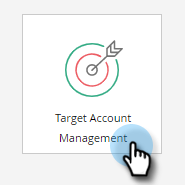

# 設定帳戶配置{#setting-up-account-profiling}

請依照下列步驟，開始使用帳戶設定檔。

>[!CAUTION]
>
>以下欄位必須隱藏&#x200B;**not**，帳戶設定檔才能正常運作。
>
>* 網站
>* 公司
>* 電子郵件
>* 國家

>
>
在此處了解如何[取消隱藏欄位](/help/marketo/product-docs/administration/field-management/hide-and-unhide-a-field.md#unhide-a-field)。

1. 在我的Marketo中，開啟&#x200B;**Target帳戶管理**。

   

1. 按一下&#x200B;**帳戶分析**&#x200B;頁簽。

   

1. 「模型」(Model)頁簽預設為開啟。 按一下「**開始使用**」。

   

1. 為模型命名，選擇將包含在結果中的人員，以及將作為理想客戶配置檔案(ICP)基礎的人員。 完成後，按一下「**建立模型**」。

   

1. 模型將開始建立。 可能需要一段時間，但別擔心，完成後會通知您。

   

1. 要查看模型的結果，請按一下&#x200B;**參閱模型結果**。

   

   現在已建立模型。

   

   >[!TIP]
   >
   >建立模型後，[了解如何調整它](/help/marketo/product-docs/target-account-management/account-profiling/account-profiling-ranking-and-tuning.md)。
