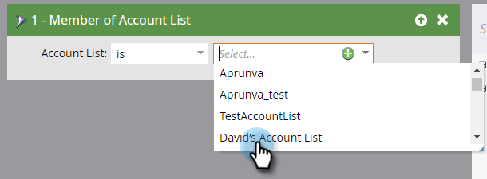
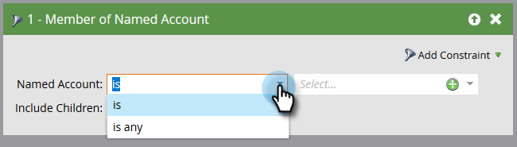
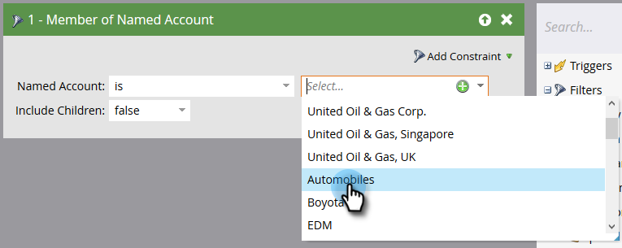

# 帳戶篩選器{#account-filters}

使用新的以帳戶為中心的篩選器，識別並吸引指名的帳戶及其中的角色。

## ABM濾鏡{#abm-filters}

1. 選擇您的智慧型促銷活動，然後按一下「智慧型清單」。****

   

1. 按一下&#x200B;**+**&#x200B;展開&#x200B;**帳戶篩選器**&#x200B;資料夾。

   

1. 將您要使用的篩選拖曳至畫布。

   

## 帳戶清單成員{#member-of-account-list}

若要使用此篩選，請按一下帳戶清單下拉式清單……

...並選擇您想要的帳戶清單。

>[!NOTE]
>
>對於「帳戶清單成員」篩選器，只有一個限定詞：&quot;is&quot; —— 沒有其他限定詞（例如&quot;is not&quot;和&quot;is any&quot;）。

## 指名帳戶{#member-of-named-account}的成員

1. 選擇限定詞。 是指特定的指名帳戶，或是任何指名帳戶。

   

1. 按一下指名的帳戶下拉式清單。

   

1. 選擇您想要的命名帳戶。

   

1. 如果您使用&quot;is any&quot;限定詞，您可能想利用[constraints](/help/marketo/product-docs/core-marketo-concepts/smart-lists-and-static-lists/using-smart-lists/add-a-constraint-to-a-smart-list-filter.md)來縮小搜尋結果。 加入您想要的數量！

   

1. 如果您只想要單一頂層帳戶的成員，請將「包含子項」設為false。 如果希望所有子帳戶的成員為true，請選擇true。

   

>[!MORELIKETHIS]
>
>[帳戶觸發器](/help/marketo/product-docs/target-account-management/engage/account-triggers.md)
