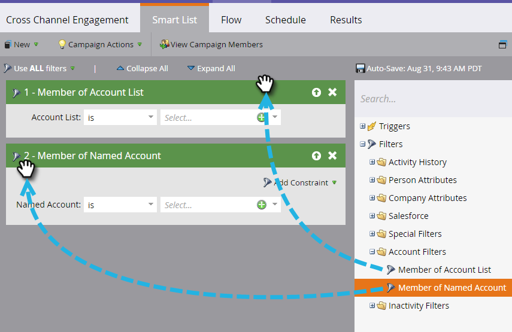

# 帳戶篩選器 {#account-filters}

使用新的以帳戶為中心的篩選器來識別並參與指定帳戶及其中的角色。

## TAM篩選 {#tam-filters}

1. 選取您的智慧型行銷活動，然後按一下 **智慧清單**.

   

1. 按一下 **+** 以展開 **帳戶篩選器** 檔案夾。

   

1. 將您要使用的篩選器拖曳至畫布。

   

## 帳戶清單成員 {#member-of-account-list}

若要使用此篩選器，請按一下帳戶清單下拉式清單……

...並選擇您想要的帳戶清單。

>[!NOTE]
>
>對於「帳戶清單成員」篩選器，只有一個限定符：&quot;is&quot; — 沒有其他限定符（例如&quot;is not&quot;和&quot;is any&quot;）。

## 指定帳戶的成員 {#member-of-named-account}

首先，選擇限定符。 **是** 指定帳戶或 **是** 任何指定帳戶。

按一下「指定帳戶」下拉清單……

...並選擇您想要的指定帳戶。

如果您使用「是任何」限定符，則可能要使用 [約束](/help/marketo/product-docs/core-marketo-concepts/smart-lists-and-static-lists/using-smart-lists/add-a-constraint-to-a-smart-list-filter.md) 來縮小搜尋結果。 盡量多加！

如果您只想要來自單一頂級帳戶的成員，請將「包含子項」設定為false。 如果要從所有子帳戶中選擇成員，請選擇true。

>[!MORELIKETHIS]
>
>[帳戶觸發器](/help/marketo/product-docs/target-account-management/engage/account-triggers.md)
