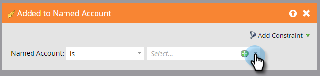

# 帳戶觸發器{#account-triggers}

使用帳戶層級觸發器，跨不同通道（如電子郵件、網頁、廣告）監聽重要帳戶層級行為活動並採取行動。

選擇您的智慧型促銷活動，然後按一下&#x200B;**[!UICONTROL Smart List]**。

在搜尋方塊中輸入「已命名帳戶」，以尋找兩個已命名帳戶觸發器。

將您要的觸發器拖曳至畫布上。 在此範例中，我們使用&#x200B;_新增至命名帳戶_。

選擇限定詞。

按一下指名的帳戶下拉式清單……

...並選擇您想要的命名帳戶。

就這樣！ 完成其餘的智慧型促銷活動後，請記得啟動它。

>[!MORELIKETHIS]
>
>[帳戶篩選](/help/marketo/product-docs/target-account-management/engage/account-filters.md)
