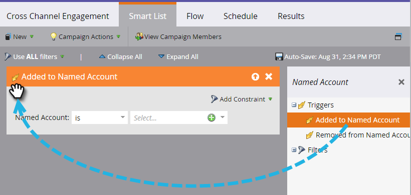

# 帳戶觸發程式 {#account-triggers}

使用帳戶層級的觸發程式，在不同管道（例如電子郵件、網路、廣告）中接聽重要帳戶層級的行為活動並採取行動。

選取您的Smart Campaign並按一下 **[!UICONTROL 智慧清單]**.

在搜尋方塊中輸入「Named Account」以尋找兩個Named Account觸發程式。

將您想要的觸發程式拖曳至畫布上。 在此範例中，我們使用 _已新增至指定帳戶_.

選擇適用對象。

按一下具名帳戶下拉式清單……

...並選擇您想要的具名帳戶。

完成了！ 完成其餘的Smart Campaign後，請記得加以啟用。

>[!MORELIKETHIS]
>
>[帳戶篩選器](/help/marketo/product-docs/target-account-management/engage/account-filters.md)
