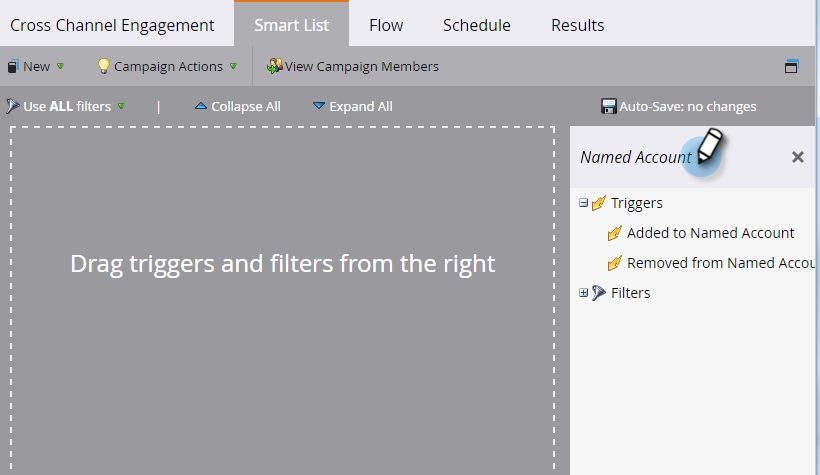

# 帳戶觸發程式 {#account-triggers}

使用帳戶層級觸發程式，跨不同管道（例如電子郵件、網路、廣告）監聽重要帳戶層級行為活動並採取行動。

選取您的智慧行銷活動，然後按一下&#x200B;**[!UICONTROL Smart List]**。

在搜尋方塊中輸入&quot;[!UICONTROL Named Account]&quot;以尋找兩個[!UICONTROL Named Account]觸發器。

將您想要的觸發器拖曳至畫布上。 在此範例中，我們使用&#x200B;_[!UICONTROL Added to Named Account]_。

選擇限定詞。

按一下具名帳戶下拉式清單……

...並選取您想要的具名帳戶。

完成了！完成其餘的智慧行銷活動後，請記得加以啟用。

>[!MORELIKETHIS]
>
>[帳戶篩選器](/help/marketo/product-docs/target-account-management/engage/account-filters.md)
