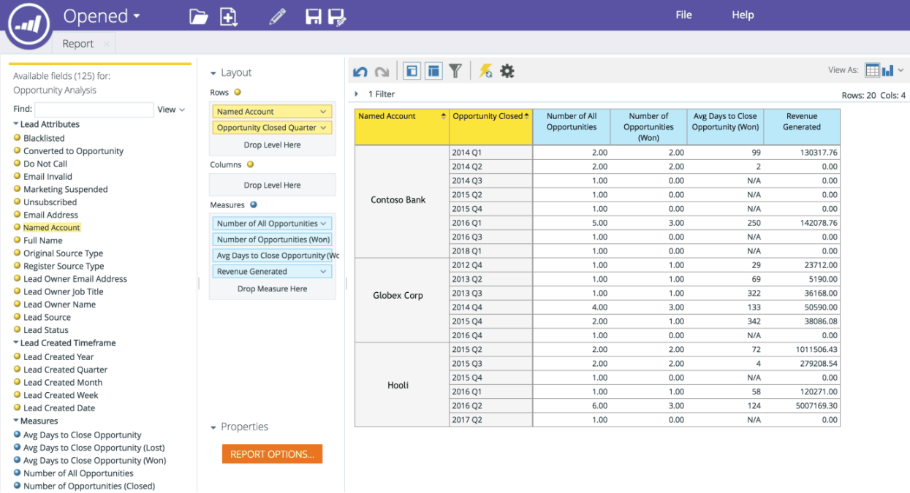

# RCA {#named-account-dimension-in-rca}中的命名帳戶Dimension

使用「收入週期分析」中ABM特定的「命名帳戶」維度建立以收入為基礎的報表。

>[!NOTE]
>
>**Dimension** -屬性（以黃點表示），可顯示不同的測量視圖。

>[!NOTE]
>
>RCA中的「命名帳戶」維度可用來測量來自目標帳戶的獲利底限影響（例如，贏得收入、在銷售週期中產生管道或加速）。 此維度也可用來識別哪些程式對指名帳戶執行得很好，哪些程式執行得不好。

下列報表可存取「命名帳戶」維度：

* 電子郵件分析
* 銷售線索分析
* 機會分析
* 方案會員分析

>[!NOTE]
>
>以下是「收入週期分析」中Marketo ABM的一些範例。

指定帳戶中的管線加速

依指名客戶劃分的通道成效與成功

方案成效與效益

指定客戶中的優質潛在客戶和參與的涵蓋範圍

