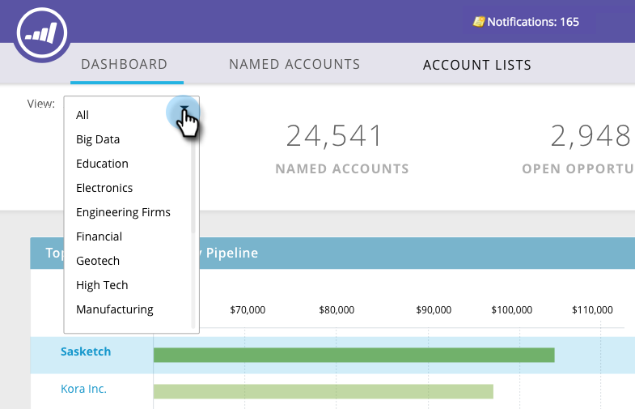

# TAM 主儀表板 {#tam-main-dashboard}

主要儀表板提供您[!UICONTROL Target Account Management]努力的摘要。 您可以看到顯示成功的目標帳戶或帳戶清單，以及需要更多注意的帳戶或帳戶清單。

若要依帳戶清單篩選，請按一下&#x200B;**[!UICONTROL View]**&#x200B;下拉式清單……

...並進行選取。 在此範例中，我們將選擇&quot;**[!UICONTROL High Tech]**&quot;帳戶清單。

若要檢視[帳戶清單儀表板](/help/marketo/product-docs/target-account-management/measure/account-list-insights.md#account-list-dashboard)，請按一下您選取的帳戶清單名稱……

...控制面板載入。

如果您不想檢視您想要向下展開至具名帳戶的帳戶清單儀表板，請按一下其名稱下的&#x200B;**[!UICONTROL More Details]**...

...並檢視[具名帳戶的深入分析](/help/marketo/product-docs/target-account-management/measure/named-account-insights.md)。

