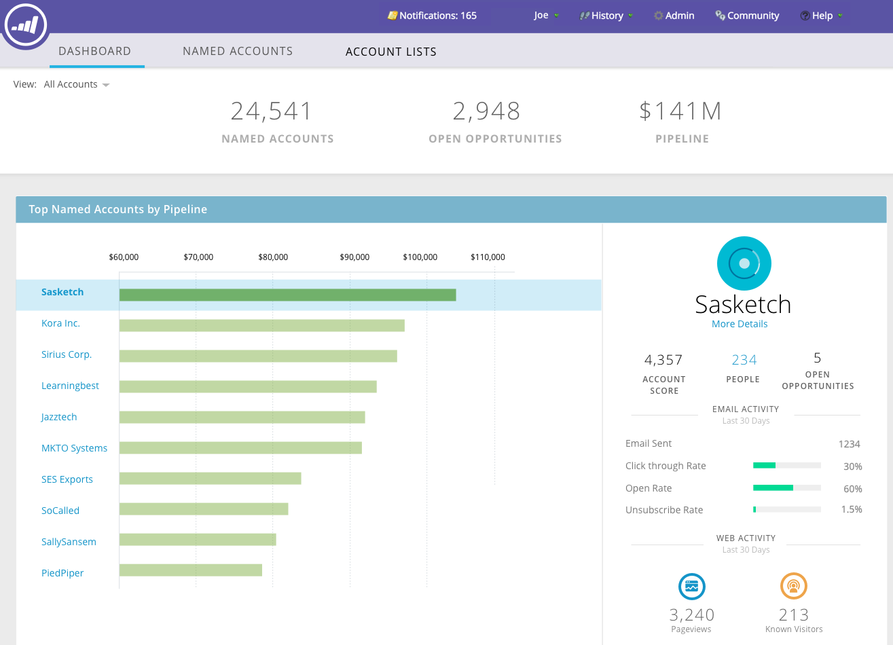

# TAM主儀表板 {#tam-main-dashboard}

主控制面板提供Target帳戶管理工作的摘要。 您可以看到顯示成功的目標帳戶或帳戶清單，以及需要更多注意的帳戶或帳戶清單。

若要依帳戶清單篩選，請按一下「檢視」下拉式清單……

...並進行選擇。 在此範例中，我們選擇「高科技」帳戶清單。

若要檢視 [帳戶清單控制面板](/help/marketo/product-docs/target-account-management/measure/account-list-insights.md#account-list-dashboard)，按一下您選取的帳戶清單名稱……

...控制面板隨即載入。

如果您不想檢視「帳戶清單控制面板」而想深入鑽研至指定帳戶，請按一下 **更多詳情** 以它的名字……

...和檢視 [已命名帳戶的深入分析](/help/marketo/product-docs/target-account-management/measure/named-account-insights.md).

