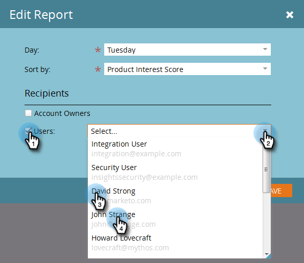

# TAM報表設定 {#tam-report-setup}

TAM銷售報告是每週傳送給客戶團隊的個人化電子郵件。

## 報表設定 {#report-setup}

1. 按一下 **管理員**.

   

1. 按一下 **目標帳戶管理**.

   

1. 在每週報表底下，按一下 **編輯**.

   

1. 按一下 **日** 下拉式清單，並選取一週中您希望收件者收到電子郵件的日期。

   

1. 若要決定電子郵件的版面配置，請按一下 **排序方式** 下拉式清單，然後進行選取。

   

1. 檢查 **使用者** 核取方塊，然後按一下下拉式清單，並選取您要接收電子郵件的對象。

   

   >[!NOTE]
   >
   >通知只會傳送給帳戶擁有者或團隊成員。

1. 按一下 **儲存**.

   

就是這樣！

## 如何取消訂閱 {#how-to-unsubscribe}

每個報表都隨附選擇退出的選項。 若要這麼做，只需按一下 **取消訂閱** 位於電子郵件底部。

## 如何重新訂閱 {#how-to-resubscribe}

1. 按一下 **管理員**.

   

1. 按一下 **目標帳戶管理**.

   

1. 在「每週報告」下，按一下列為「已取消訂閱」的數字。

   

1. 按一下 **使用者** 下拉式清單。

   

1. 再次選取您要接收電子郵件的使用者並按一下 **重新訂閱**.

   
