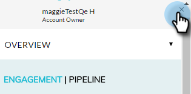

# [!DNL Account Insight]外掛程式概述 {#account-insight-plug-in-overview}

[!DNL Account Insight]是[!DNL Chrome]外掛程式，可向您的銷售團隊呈現可操作的TAM和帳戶分析，讓他們更有效地與帳戶互動。

>[!AVAILABILITY]
>
>* 同時擁有TAM和Marketo Sales Insight的所有客戶都可使用Insight帳戶。 對於只有TAM的客戶，帳戶Insight可作為已購買的附加元件使用。 每個客戶最多只能擁有250個Insight帳戶名額。 如需詳細資訊，請聯絡您的銷售代表。 沒有TAM的客戶無法使用。
>
>* 此外掛程式目前與[Adobe身分驗證](/help/marketo/product-docs/administration/marketo-with-adobe-identity/adobe-identity-management-overview.md){target="_blank"}不相容。

>[!CAUTION]
>
>[!DNL Account Insight]外掛程式無法在已啟用[僅SSO](/help/marketo/product-docs/administration/additional-integrations/restrict-user-login-to-sso-only.md) （單一登入）的訂閱中運作。

>[!CAUTION]
>
>從帳戶、潛在客戶或連絡人啟動外掛程式時，CRM內容適用於Salesforce。 從帳戶、潛在客戶或連絡人啟動外掛程式時，CRM內容無法用於Dynamics。 對於Dynamics使用者，建議使用[!DNL Account Insight]外掛程式。

## 已命名帳戶 {#named-accounts}

按帳戶彼此之間的等級順序檢視具名帳戶。 此清單僅供帳戶擁有者使用。 即將提供帳戶團隊支援。

若要檢視具名帳戶的詳細資料，請按一下其名稱……

...且總覽隨即顯示。

使用下拉式選單檢視有趣的時刻。

向下捲動以檢視最佳選擇。 有趣的時刻也在這裡，參與人士也在這裡。

按一下人員名稱……

...並檢視其活動。

您也可以將檢視從&#x200B;**[!UICONTROL Engagement]**&#x200B;切換為&#x200B;**[!UICONTROL Pipeline]**。

若要退出具名帳戶，請按一下右上角的X。

## [!UICONTROL Activity Feed] {#activity-feed}

活動摘要會顯示最近活動，而且會追溯到七天。

按一下&#x200B;**[!UICONTROL Filter]**&#x200B;下拉式清單，依不同的活動型別篩選。

有數個專案可供點按。 按一下具名帳戶以檢視其詳細資料。 按一下使用者的名稱以檢視其活動。 按一下「**[!UICONTROL More Activities]**」即可檢視更多活動。

很酷的東西！

>[!MORELIKETHIS]
>
>[設定 [!DNL Account Insight]](/help/marketo/product-docs/target-account-management/setup-tam/set-up-account-insight.md)
