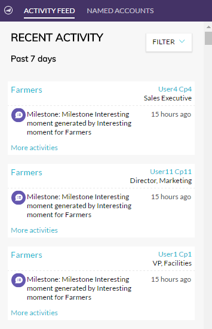

# Account Insight外掛程式概述 {#account-insight-plug-in-overview}

Account Insight是Chrome外掛程式，可向您的銷售團隊顯示可操作的TAM和帳戶分析，讓他們更有效地與客戶互動。

>[!AVAILABILITY]
>
>所有同時擁有TAM和Marketo Sales Insight的客戶，都可使用Account Insight。 若客戶只有TAM，可透過購買的附加元件使用「帳戶分析」。 每個客戶最多只能有250個Account Insight座位。 請聯繫您的銷售代表以了解詳情。 無TAM的客戶無法使用。

>[!CAUTION]
>
>Account Insight外掛程式在具有 [僅SSO](/help/marketo/product-docs/administration/additional-integrations/restrict-user-login-to-sso-only.md) （單一登入）已啟用。

>[!CAUTION]
>
>從帳戶、銷售機會或連絡人啟動外掛程式時，CRM內容適用於Salesforce。 從帳戶、銷售機會或連絡人啟動外掛程式時，CRM內容將無法用於Dynamics。 若為Dynamics使用者，建議使用Account Insight外掛程式。

## 已命名帳戶 {#named-accounts}

請參閱已命名的帳戶，依其彼此的排名順序。 此清單僅供帳戶擁有者使用。 客戶團隊支援即將推出。

要查看已命名帳戶的詳細資訊，請按一下其名稱……

...並顯示概述。

使用下拉式清單，查看有趣的時刻。

向下捲動以查看最佳下注。 有趣的時刻也在此，與參與的人一起。

按一下人員姓名……

...並查看其活動。

您也可以將檢視從「參與」切換至「管道」。

若要退出指定帳戶，請按一下右上角的X。

## 活動摘要 {#activity-feed}

活動摘要會顯示最近的活動，可追溯至七天。

按一下 **篩選** 下拉式清單，依不同活動類型篩選。

可點按數個項目。 按一下已命名的帳戶以查看其詳細資訊。 按一下使用者的名稱以查看其活動。 按一下「更多活動」可查看更多活動。

真酷！

>[!MORELIKETHIS]
>
>[設定帳戶分析](/help/marketo/product-docs/target-account-management/setup-tam/set-up-account-insight.md)
