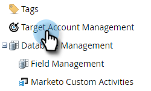

# 帳戶分數 {#account-score}

帳戶分數是Target帳戶管理的重要部分。 它可協助您判斷帳戶的參與程度。

## 帳戶分數是多少？ {#what-is-account-scoring}

這是一種系統化方法，旨在協助銷售和行銷團隊識別並排定最可能購買的公司（包括潛在客戶）的優先順序。

在B2B購買程式的複雜世界中，單一個人做出購買決策的機會很少。 參與的角色往往各有不同，各有其需求。 基於帳戶的分數通過從多個銷售線索中聚合銷售線索分數並在帳戶級別提供分數來考慮這一點。

## 常見範例 {#common-examples}

<table> 
 <tbody>
  <tr>
   <td><strong>帳戶參與分數</strong></td> 
   <td>根據特定目標帳戶中人員在各種管道（例如電子郵件、網頁和廣告）上追蹤的行為活動而進行的參與深度。</td>
  </tr>
  <tr>
   <td><strong>帳戶產品興趣分數</strong></td>
   <td>目標帳戶中對特定產品內容感興趣的人員（例如下載白皮書）。</td> 
  </tr>
  <tr>
   <td><strong>帳戶網路參與分數</strong></td>
   <td>來自目標帳戶的人員瀏覽Web頻道。 可以建立相同的分數來測量來自電子郵件、廣告或其他管道的管道參與度。</td> 
  </tr>
 </tbody>
</table>

## 如何設定帳戶分數 {#how-to-configure-account-score}

>[!NOTE]
>
>若要計算帳戶分數，您必須先建立銷售機會分數。 Marketo TAM會自動將銷售機會分數匯總至帳戶分數。 舉例來說，我們會舉兩個上述範例(_帳戶產品興趣分數_ 和 _帳戶網路參與分數_)。
>
>首先，建立銷售機會分數欄位，從目標帳戶的每個銷售機會擷取相關詳細資訊。\
>然後，將這些銷售機會分數指派給其各自的帳戶分數：\
>帳戶產品興趣分數= SUM（銷售機會產品興趣分數）\
>帳戶Web參與分數= SUM（銷售機會Web參與分數）

>[!NOTE]
>
>使用者可以建立多個帳戶參與分數，並將不同的人員分數指派給不同的帳戶分數。

設定銷售機會分數後，請依照下列步驟繼續操作。

1. 按一下 **管理**.

   

1. 按一下 **目標帳戶管理**.

   

1. 在計分欄位中，按一下 **編輯**.

   

   >[!NOTE]
   >
   >您可以選擇 **五** 欄位來計算帳戶分數。

1. 輸入帳戶分數名稱，按一下 **選擇人員分數** 下拉式清單中，並選取對應的分數。

   

1. 按一下 **+添加** 以新增更多分數。

   

1. 新增所有需要的分數。 按一下 **儲存** 時才能使用。

   
