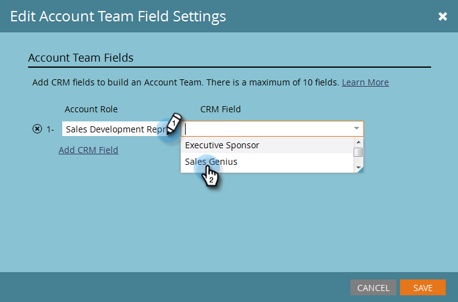

# 帳戶團隊設定 {#account-team-setup}

帳戶團隊是在指定帳戶上共同工作的一組利害關係人。 請依照下列步驟來選擇應新增的CRM帳戶角色。

1. 按一下 **管理員**.

   

1. 按一下 **目標帳戶管理**.

   

1. 在「帳戶專案團隊成員」下，按一下 **編輯**.

   

   >[!NOTE]
   >
   >若為「帳戶角色」，請為其命名，並將其比對至您CRM中所需的「使用者查詢」欄位。

1. 輸入您的帳戶角色名稱，然後選取 **CRM** 欄位。 最多加上10個。

   

   >[!NOTE]
   >
   >您無法選取帳戶擁有者。 預設會從CRM中的帳戶層級選擇。

1. 按一下 **儲存** 完成時。

   

   >[!CAUTION]
   >
   >如果您進行更新，則可能需要一些時間才能將變更反映在TAM中。

   >[!NOTE]
   >
   >* 當具有不同帳戶擁有者的多個CRM帳戶合併到具名帳戶時，Marketo會挑選一個「帳戶擁有者」，並將其他帳戶擁有者新增為「帳戶共同擁有者」
   >
   >* 如果稍後重新命名或刪除CRM「角色」欄位，Marketo TAM將停止同步更新的值，直到使用者手動更新TAM中的設定為止
