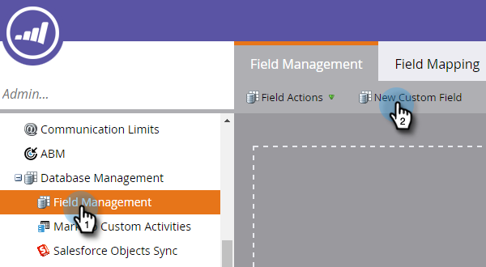

# 建立CRM探索的自訂欄位 {#create-a-custom-field-for-crm-discovery}

新增自訂欄位到帳戶，將它們對應到您的CRM，並使用它們在Marketo中進行CRM帳戶探索。

1. 按一下 **管理員**.

   

1. 按一下 **欄位管理**，然後 **新增自訂欄位**.

   

1. 按一下 **物件** 下拉式清單並選取 **具名帳戶**.

   

1. 按一下 **型別** 下拉式清單，然後選取型別。

   

1. 輸入 **名稱** （API名稱會自動填入）並按一下 **建立**.

   

1. 建立欄位後，從右側的樹狀結構中選取該欄位。 按一下 **欄位動作** 下拉式清單並選取 **對應到CRM欄位**.

   

1. 選取您要對應到的CRM帳戶欄位，然後按一下 **儲存**.

   

   同步後，您的新欄位將顯示在您Discover CRM格線的最右側。

   
