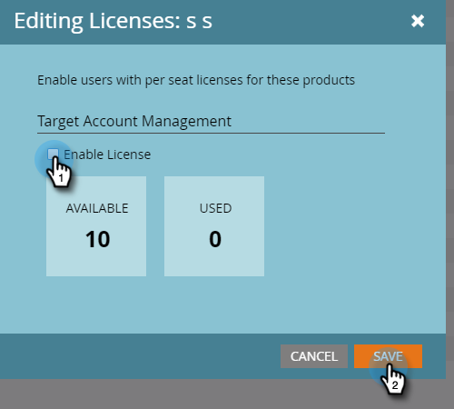

# 核發許可證{#issue-a-license}

您需要為用戶設定使用TAM的許可證。 這是如何做到的。

>[!NOTE]
>
>可用授權的數量視您的訂閱而定。 如果您需要更多資訊，請連絡您的銷售代表。

1. 按一下&#x200B;**管理**。

   

1. 按一下「**用戶和角色**」。 選擇要頒發許可證的用戶，按一下&#x200B;**發放許可證**&#x200B;下拉式清單，然後選擇&#x200B;**目標帳戶管理**。

   

1. 勾選「**啟用授權**」核取方塊，然後按一下「儲存&#x200B;**」。**

   

   >[!NOTE]
   >
   >要刪除用戶的許可證，請按照步驟1，然後取消選中該複選框，然後按一下「保存」。****
