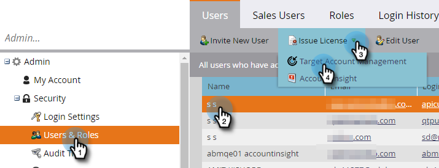

# 發行授權 {#issue-a-license}

您必須將使用者設定為擁有使用TAM的授權。 以下說明該怎麼做。

>[!NOTE]
>
>可用授權數量會依您的訂閱而有所不同。 如果您需要更多資訊，請連絡您的銷售代表。

1. 按一下 **管理員**.

   

1. 按一下 **使用者和角色**. 選取要向其發放授權的使用者，按一下 **發行授權** 下拉式清單，然後選取 **目標帳戶管理**.

   

1. 檢查 **啟用授權** 核取方塊並按一下 **儲存**.

   

   >[!NOTE]
   >
   >若要移除使用者的授權，請遵循步驟1，然後取消勾選核取方塊並按一下 **儲存**.
