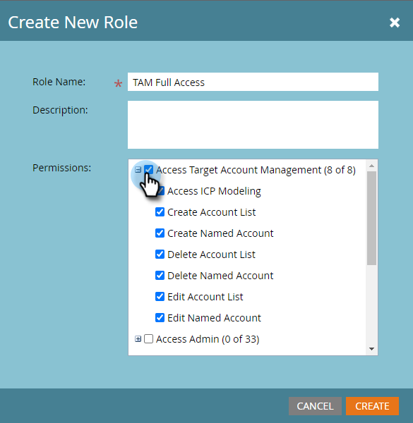

# 權限 {#permissions}

您需要為使用者設定權限，才能使用TAM。 這是方法。

1. 按一下 **管理**.

   

1. 按一下 **使用者與角色**.

   

   >[!NOTE]
   >
   >您可以為現有角色新增TAM權限，或建立全新角色。 此範例使用新角色。

1. 按一下 **角色**，然後 **新角色**.

   

1. 輸入角色名稱，然後按一下 **+** 圖示（位於「存取Target帳戶管理」核取方塊旁）。

   

1. 要選擇 _all_ 權限，只需檢查 **存取目標帳戶管理** 核取方塊。

   

   >[!NOTE]
   >
   >您也可以選擇僅選取部分選項。 請個別勾選每個核取方塊，即可執行此動作。

1. 按一下 **+** 開啟「存取管理」功能表。 檢查 **訪問ABM管理員** 複選框（ABM是TAM的前名），然後按一下 **建立**.

   

   您的新TAM角色現在已可以 [指派給使用者](/help/marketo/product-docs/administration/users-and-roles/managing-user-roles-and-permissions.md#assign-roles-to-a-user)!
