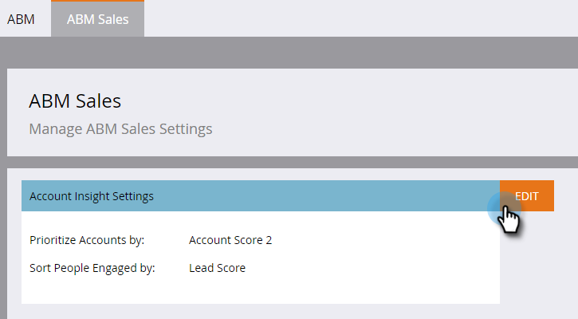

# 設定帳戶分析{#set-up-account-insight}

以下是如何設定帳戶分析。

>[!PREREQUISITES]
>
>ABM帳戶分數[必須先設定](/help/marketo/product-docs/target-account-management/setup-tam/account-score.md)。

1. 按一下&#x200B;**管理**。

   

1. 按一下樹中的&#x200B;**ABM** ，然後按一下&#x200B;**ABM銷售**&#x200B;頁籤。

   

1. 按一下&#x200B;**編輯**。

   

1. 按一下下拉式清單，選擇「帳戶分析」如何排定指名帳戶和參與人員的優先順序。

   

   >[!NOTE]
   >
   >如果[帳戶分數設定](/help/marketo/product-docs/target-account-management/setup-tam/account-score.md)在任何時候都已更新，管理員必須更新ABM銷售下的設定，以確保分數能正確反映使用者的偏好。 使用者需要登出並登入，才能查看變更。

1. 按一下&#x200B;**保存**。

   
