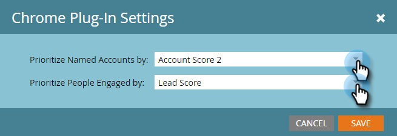

# 設定帳戶分析 {#set-up-account-insight}

以下是如何設定Account Insight。

>[!PREREQUISITES]
>
>TAM帳戶分數 [必須設定](/help/marketo/product-docs/target-account-management/setup-tam/account-score.md) 首先。

1. 按一下 **管理員**.

   

1. 按一下 **目標帳戶管理** 在樹狀結構中，然後 **銷售** 標籤。

   

1. 按一下 **編輯**.

   

1. 按一下下拉式清單，以選擇「帳戶分析」如何優先處理具名帳戶和參與的人員。

   

   >[!NOTE]
   >
   >如果 [帳戶分數設定](/help/marketo/product-docs/target-account-management/setup-tam/account-score.md) 會隨時更新，Sales底下的設定需要由管理員更新，以確保分數準確反映使用者的偏好設定。 使用者需要登出並重新登入才能檢視變更。

1. 按一下 **儲存**.

   
