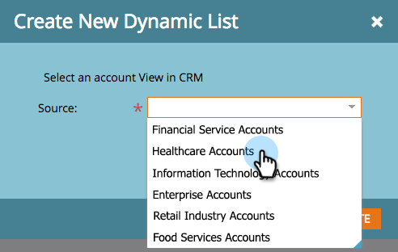

# 帳戶清單 {#account-lists}

帳戶清單是可同時鎖定的已命名帳戶的集合。 帳戶清單可讓您依產業、位置或公司大小來鎖定指定帳戶。

除了帳戶清單外，您也可以建立從公開CRM帳戶檢視產生的動態帳戶清單。 「CRM帳戶檢視」是一組規則，在顯示帳戶時可作為篩選器。 例如，您可以使用它查找「行業」為「醫療保健」的帳戶 *和* 收入超過1億美元。

>[!NOTE]
>
>在中建立智慧清單和Web促銷活動時，在Marketo Target帳戶管理中建立的帳戶清單會自動可用 [網頁個人化](/help/marketo/product-docs/web-personalization/using-web-segments/web-segments.md).

## 建立新帳戶清單 {#create-a-new-account-list}

1. 按一下 **新增** 下拉式清單並選取 **建立新帳戶清單**.

   

1. 為清單命名，然後按一下 **建立**.

   

1. 建立帳戶清單後，請開始使用 [將指定帳戶添加到](/help/marketo/product-docs/target-account-management/target/named-accounts/add-an-existing-named-account-to-an-account-list.md)!

   >[!NOTE]
   >
   >Marketo只會顯示具有2,000個或更少指定帳戶之帳戶清單的前瞻分析。

## 建立新的動態帳戶清單 {#create-a-new-dynamic-account-list}

1. 按一下 **新增** 下拉式清單並選取 **建立新動態清單**.

   

1. 在對話方塊中，選取 **CRM帳戶檢視** 從下拉式清單中，或輸入名稱以搜尋。

   

1. 按一下 **建立**。

   

   >[!NOTE]
   >
   >在Salesforce中，請務必向同步用戶提供「清單視圖對象」權限。

## 重新命名帳戶清單 {#rename-an-account-list}

>[!NOTE]
>
>這些步驟僅適用於帳戶清單。 _動態_ 帳戶清單會使用其相關聯CRM帳戶檢視的名稱。

1. 選擇要更名的帳戶，按一下 **帳戶清單動作** 下拉式清單並選取 **更名帳戶清單**.

   

1. 輸入新名稱，然後按一下 **重新命名**.

   

   >[!NOTE]
   >
   >CRM帳戶檢視每8小時會同步至動態帳戶清單。 如果尚未同步，Marketo會在下一個週期中同步。

## 刪除帳戶清單 {#delete-an-account-list}

>[!NOTE]
>
>帳戶清單和動態帳戶清單的這些步驟相同。

1. 選取您要刪除的帳戶，按一下 **帳戶清單動作** 下拉式清單並選取 **刪除帳戶清單**.

   

1. 按一下 **刪除**.

   

>[!MORELIKETHIS]
>
>* [將現有的指定帳戶新增至帳戶清單](/help/marketo/product-docs/target-account-management/target/named-accounts/add-an-existing-named-account-to-an-account-list.md)
>* [帳戶清單分析](/help/marketo/product-docs/target-account-management/measure/account-list-insights.md)

