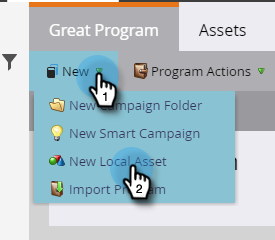
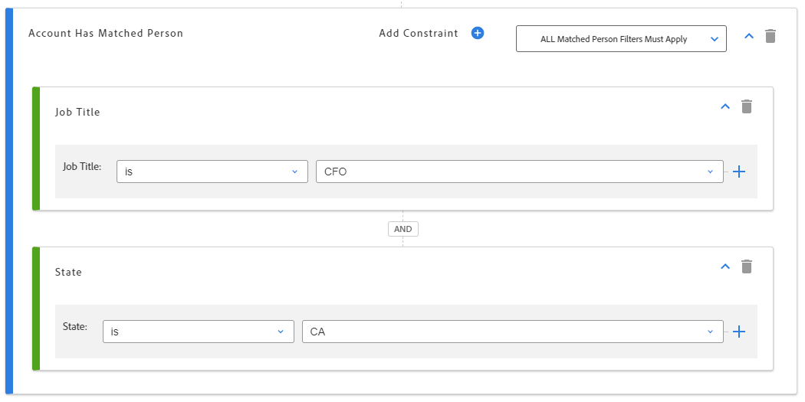
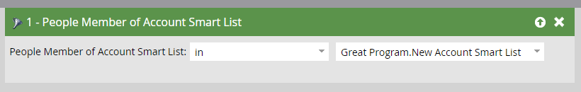

# 帳戶智慧清單{#account-smart-lists}

以下說明如何快速精確地識別高價值客戶。

>[!NOTE]
>
>此功能是在Open Beta版中提供的，適用對象是同時啟用TAM和Marketo Next-Gen使用者體驗的任何人。 如果您想要參加測試版，請聯絡您的CSM。

## 建立帳戶智慧清單{#create-an-account-smart-list}

1. 在Marketo中，前往&#x200B;**行銷活動**。

   

1. 尋找並選取您想要的程式。

   

1. 按一下&#x200B;**新建**&#x200B;下拉清單並選擇&#x200B;**新建本地資產**。

   

1. 按一下&#x200B;**帳戶智慧清單**。

   

1. 輸入名稱，然後按一下&#x200B;**建立**（說明和標籤是可選的）。

   

您的帳戶智慧清單已建立！ 請參閱下方以取得定義規則的步驟。

## 帳戶智慧清單規則{#account-smart-list-rules}

帳戶智慧清單與標準智慧清單的工作方式類似，但有一個顯著例外：容器。

1. 要定義帳戶智慧清單，請按一下&#x200B;**帳戶智慧清單規則**&#x200B;頁籤。

   

1. 選擇您想要的帳戶篩選。 在此示例中，我們選擇&#x200B;_行業是Healthcare_。

   

   

1. 選擇您的「相符人員篩選」。 在此範例中，我們選擇「州為California _」。_

   

**可選步驟**:這裡是容器的入口。如果您選擇其他「符合的人員篩選」，您可將其拖曳至第一個篩選下方，或在&#x200B;_中_，以建立容器。 在此範例中，我們要新增&#x200B;_職稱為CFO_&#x200B;來建立容器。

這是容器的外觀。

>[!NOTE]
>
>建立篩選器容器會建立「and」規則，這表示它只會傳回所有結合的結果。 在此範例中，說明醫療保健產業，以及位於加州&#x200B;_和_&#x200B;且有人列為CFO。 如果您不想使用容器，只需將篩選拖曳至現有容器的下方／上方。

就這樣！ 請參閱以下章節，瞭解如何運用您的「帳戶智慧清單」。

>[!TIP]
>
>就像標準智慧型清單一樣，您可以使用進階邏輯進一步調整結果。 您至少需要三個篩選器才能這麼做，而在「帳戶智慧型清單」中，一個容器（不論其本身包含多少個篩選器）等於一個篩選器。

## 帳戶智慧清單操作{#account-smart-list-actions}

在「帳戶智慧型清單」的「概述」索引標籤中，您會注意到一些動作選項。

**匯出**:這會將「帳戶智慧清單」的結果匯出為CSV。

**克隆**:製作帳戶智慧型清單的副本。

**傳送至廣告網路**:將清單以新的相符對象傳送至LinkedIn。

您也可以使用&#x200B;_帳戶智慧清單的人員成員_&#x200B;篩選器，在標準智慧型促銷活動／清單中參考您的帳戶智慧清單。

>[!NOTE]
>
>帳戶智慧清單的「人員會員」結果將顯示識別帳戶中的每個人員，而不只是透過帳戶智慧清單中的「相符人員」篩選器找到的人員。

>[!NOTE]
>
>**定義**
>
>**帳戶智慧清單的人員成員**:在本例中，「會員」一詞是指帳戶本身，因此「會員」系指這些帳戶中的實際人員（行銷人員記錄）。
