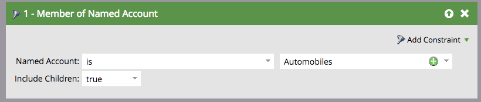

# ABM階層{#abm-hierarchies}

階層可讓ABM使用者在其CRM中繼承指名帳戶之間的父／子關係。

## 什麼是ABM等級？{#what-are-abm-hierarchies}

公司可以有多個部門和子公司。 這些公司通常通過稱為階層的父子關係來組織自己。 ABM可以從SFDC或MSD整合繼承這些層次結構，並允許您以單個系列的形式處理不同的部門。

## 使用ABM層次{#working-with-abm-hierarchies}

使用ABM階層，您可以在命名帳戶控制面板中快速取得整個階層或個別帳戶的相關資訊。

未使用階層

使用階層

>[!NOTE]
>
>Marketo介面最多只會顯示10個層級（父帳戶的子帳戶和孫帳戶），但您可建立的子帳戶數目沒有限制。

只需按一下[，即可定位並報告整個階層。](/help/marketo/product-docs/target-account-management/engage/account-filters.md#member-of-named-account)

