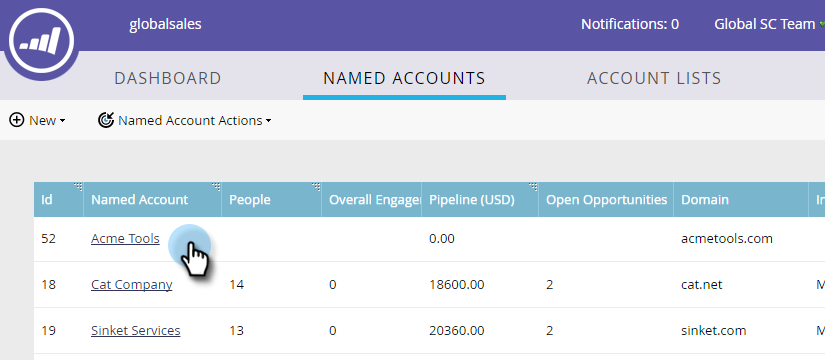

# 將現有的具名帳戶新增至帳戶清單 {#add-an-existing-named-account-to-an-account-list}

將具名帳戶新增至帳戶清單相當簡單。

>[!NOTE]
>
>這僅適用於帳戶清單， **非** 動態帳戶清單。

1. 選取要新增至的具名帳戶列。

   

1. 按一下 **具名帳戶動作** 下拉式清單並選取 **新增至帳戶清單**.

   

1. 按一下 **帳戶清單** 從下拉式清單中選取所需的帳戶清單，然後按一下 **新增**.

   

   完成了！

>[!MORELIKETHIS]
>
>[建立具名帳戶](/help/marketo/product-docs/target-account-management/target/named-accounts/create-a-named-account.md)
