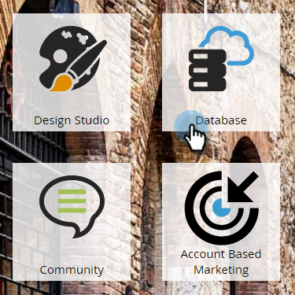

# 將人員新增至指名帳戶{#add-people-to-a-named-account}

在ABM中，手動將人員添加到指定帳戶有三種不同的方法。

## 單流操作{#single-flow-action}

1. 按一下&#x200B;**Database**。

   

1. 輸入人員的電子郵件地址，然後按Enter鍵。

   

1. 按一下該人選取。 按一下「**人員動作**」下拉式清單，按一下「**行銷**」並選取「新增至命名帳戶」。****

   

1. 按一下「**命名帳戶**」下拉式清單，選取所要的「命名帳戶」，然後按一下「立即執行&#x200B;**」。**

   

## 智慧型促銷活動流量步驟{#smart-campaign-flow-step}

1. 選擇您的智慧型促銷活動，然後按一下&#x200B;**流量**。

   

1. 在搜尋方塊中輸入「新增至命名帳戶」。

   

1. 將篩選拖曳至畫布上。

   

1. 按一下「**命名帳戶**」下拉式清單，然後選取所要的命名帳戶。

   

   就這樣！ 接下來，您只需排程（或啟用）智慧型促銷活動，流程步驟就會開始將符合資格的人員新增至指定的指定帳戶。

## 清單匯入{#list-import}

1. 選擇清單，按一下「列出操作」下拉式清單，然後選擇「導入清單」。********

   

1. 選擇檔案和設定後，按一下&#x200B;**Next**。

   

1. 對應您所要的欄位。 請確定&#x200B;**命名帳戶**&#x200B;欄位已映射。

   

1. 選擇您想要的設定，然後按一下「匯入」。****

   

>[!MORELIKETHIS]
>
>[銷售機會與帳戶匹配](/help/marketo/product-docs/target-account-management/target/named-accounts/lead-to-account-matching.md)
