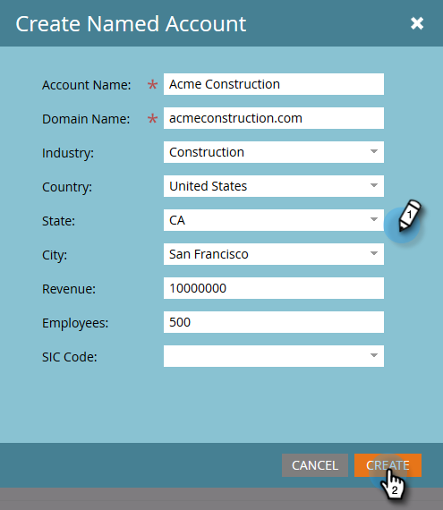

# 建立具名帳戶 {#create-a-named-account}

請依照下列步驟，手動建立具名帳戶。

1. 在已命名的帳戶中，按一下 **新增** 下拉式清單並選取 **建立具名帳戶**.

   

1. 填寫所需欄位，然後按一下 **建立**.

   

   >[!TIP]
   >
   >直接按一下具名帳戶以檢視其控制面板。

>[!MORELIKETHIS]
>
>[將人員新增至具名帳戶](/help/marketo/product-docs/target-account-management/target/named-accounts/add-people-to-a-named-account.md)
