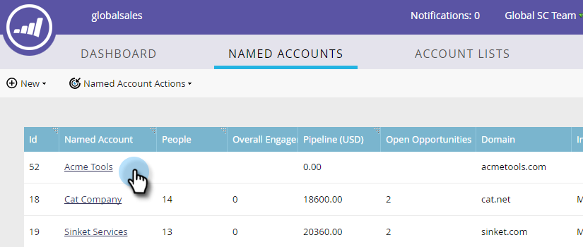

# 刪除[!UICONTROL Named Account] {#delete-a-named-account}

請依照下列快速步驟刪除已命名的帳戶。

1. 選取要刪除之具名帳戶的列。

   

   >[!NOTE]
   >
   >按住Ctrl鍵並按一下(Windows)或按住Cmd鍵並按一下(Mac)以選取多個具名帳戶。

1. 按一下&#x200B;**[!UICONTROL Named Account Actions]**&#x200B;下拉式清單，然後選取&#x200B;**[!UICONTROL Delete Named Account]**。

   

1. 按一下「**[!UICONTROL Delete]**」。

   

   >[!NOTE]
   >
   >在TAM中無法刪除已同步至您CRM的帳戶。 如果刪除選項無法使用，或您收到「由於選取一個或多個CRM帳戶而無法刪除這些帳戶」訊息，則必須直接在CRM中刪除這些帳戶。
