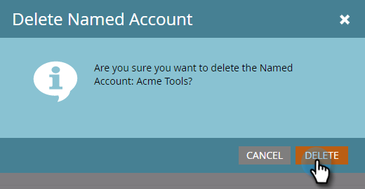

# 刪除命名帳戶{#delete-a-named-account}

請依照下列快速步驟刪除已命名的帳戶。

1. 選擇要刪除的已命名帳戶行。

   

   >[!NOTE]
   >
   >按住Ctrl鍵並按一下(Windows)或Cmd鍵並按一下(Mac)，以選取多個已命名的帳戶。

1. 按一下&#x200B;**命名帳戶操作**&#x200B;下拉式清單並選擇&#x200B;**刪除命名帳戶**。

   

1. 按一下&#x200B;**Delete**。

   

   >[!NOTE]
   >
   >無法在ABM中刪除與您的CRM同步的帳戶。 如果刪除選項不可用，或者您收到「因為選取一或多個CRM帳戶而無法刪除這些帳戶」訊息，則必須直接在CRM中刪除這些帳戶。
