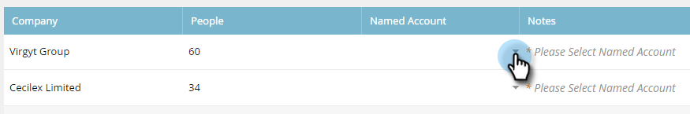
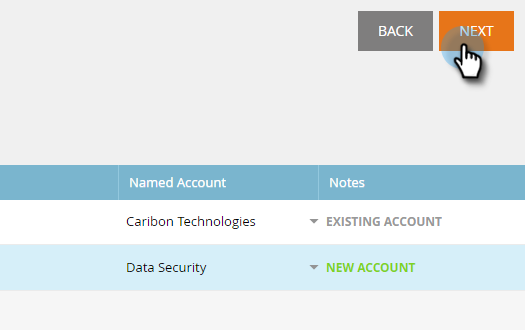

# 探索帳戶 {#discover-accounts}

使用Discover選項來識別潛在的目標帳戶。

## 探索CRM帳戶 {#discover-crm-accounts}

從您的CRM識別潛在目標帳戶。

>[!NOTE]
>
>將CRM連線至Marketo TAM後， **探索CRM帳戶** 將顯示所有CRM帳戶和相關資訊，協助您選擇正確的具名帳戶。 Marketo會針對從CRM收到的內容新增其他資訊。

**人員** (在探索CRM帳戶和探索Marketo公司中)：包含聯絡人和潛在客戶。 使用Marketo可探索銷售機會 [銷售線索與帳戶的比對](/help/marketo/product-docs/target-account-management/target/named-accounts/lead-to-account-matching.md).

**潛在人員** (在探索CRM帳戶與探索Marketo公司中)：顯示Marketo找到多少潛在客戶可能屬於CRM帳戶。

**自訂CRM欄位** （僅限探索CRM帳戶）：這可協助您協調銷售和行銷組織，以選取正確的目標帳戶。 一旦您 [對應自訂CRM欄位](/help/marketo/product-docs/target-account-management/setup-tam/create-a-custom-field-for-crm-discovery.md) 透過Marketo TAM，我們將顯示對應的資料，以協助您識別目標帳戶。

1. 在已命名的帳戶中，按一下 **新增** 下拉式清單並選取 **探索CRM帳戶**.

   

1. 將會開啟新視窗/標籤。 選取您要新增至具名帳戶的CRM帳戶，然後按一下 **下一個**.

   

1. 預覽畫面會確認您選擇的數量。 按一下 **建立**。

   

   這就是所有步驟！

   

## 探索Marketo公司 {#discover-marketo-companies}

識別目標定位的正確公司。

>[!NOTE]
>
>在探索Marketo公司中，您會看到並非來自您CRM的Marketo公司。

1. 在已命名的帳戶中，按一下 **新增** 下拉式清單並選取 **探索Marketo公司**.

   

1. 將會開啟新視窗/標籤。 選取您要新增至具名帳戶的公司，然後按一下 **下一個**.

   

   >[!NOTE]
   >
   >在探索Marketo公司和探索CRM中，Marketo會自動執行以下操作：
   >
   >* 從您的Marketo資料庫中尋找記錄中列出該公司的人員。 如果您看到某些屬性（例如「產業」）的多個值，是因為Marketo發現針對這些個人列出的不同值。 點選次數最多的屬性會獲勝
   >
   >在 **探索CRM** 僅限Marketo自動：
   >
   >* 同步並建立CRM連絡人與指定帳戶的關聯
   >
   >在 **探索Marketo公司** 僅限Marketo自動：
   >
   >* 將大多數網際網路服務提供者和公用網域(例如yahoo.com、gmail.com)篩選為公司名稱
   >
   >* 刪除CRM帳戶的重複專案。 如果您有一筆記錄中有「Acme」且「Acme Inc」（或下列任一尾碼：Co， Corp， Corporation， Gmbh， Inc， Incorporated， LLC， LLP， LP， Ltd， PA， PC， PLC， PLLC），我們會將它們合併到TAM中，就像「Acme」一樣
   >
   >如果您希望Marketo依CRM ID或帳戶擁有者（而非公司名稱）刪除重複帳戶，請聯絡 [Marketo支援](https://nation.marketo.com/t5/Support/ct-p/Support).

1. 按一下具名帳戶欄下方的向下箭頭，以顯示下拉式清單。

   

   >[!CAUTION]
   >
   >今後，這些選定公司中的任何新人員都會自動指派給其個別具名帳戶。 請仔細檢查這些公司，並確定已將它們指派給正確的指定帳戶。

1. 若要選取現有帳戶，請按一下 **具名帳戶** 從下拉式清單中選擇所需的帳戶，然後按一下 **下一個**.

   

   您也可以選擇直接在下拉式方塊中輸入所要的名稱，以建立新的具名帳戶。 完成時，按一下離開方塊……

   

   ...您將會看到新的具名帳戶。 在那個時間點按一下 **下一個** 例如在步驟4中。

   

1. 按一下 **建立**。

   

   做得很好！

   

>[!NOTE]
>
>如果您看到選取的CRM帳戶與Discover CRM格線中的帳戶不相符，可能是因為下列一或多個原因：
>
>* 擁有名稱類似，但已進行重複資料刪除的不同CRM帳戶
>* 下一個排定的同步尚未發生

>[!MORELIKETHIS]
>
>[銷售線索與帳戶的比對](/help/marketo/product-docs/target-account-management/target/named-accounts/lead-to-account-matching.md)
