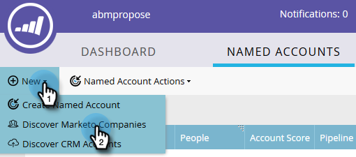
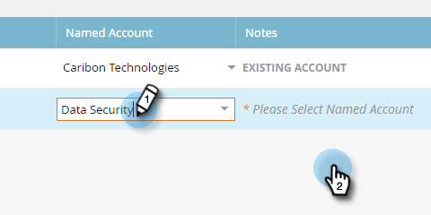

# Discover帳戶 {#discover-accounts}

使用Discover選項來識別潛在目標帳戶。

## 發現CRM帳戶 {#discover-crm-accounts}

從您的CRM中識別潛在目標帳戶。

>[!NOTE]
>
>將CRM連接至Marketo TAM後， **發現CRM帳戶** 會顯示所有CRM帳戶和相關資訊，協助您選擇正確的已命名帳戶。 Marketo會在從CRM收到的內容之外新增其他資訊。

**人員** (在Discover CRM帳戶和Discover Marketo公司中):包括聯繫人和銷售線索。 可使用Marketo [銷售機會對帳](/help/marketo/product-docs/target-account-management/target/named-accounts/lead-to-account-matching.md).

**潛在人員** (在Discover CRM帳戶和Discover Marketo公司中):顯示Marketo發現多少潛在客戶可能屬於CRM帳戶。

**自訂CRM欄位** （僅限於Discover CRM帳戶）:這將幫助您調整銷售和營銷組織，以選擇正確的目標帳戶。 一旦您 [對應自訂CRM欄位](/help/marketo/product-docs/target-account-management/setup-tam/create-a-custom-field-for-crm-discovery.md) 透過Marketo TAM，我們會顯示對應的資料，協助您識別目標帳戶。

1. 在「指定帳戶」中，按一下 **新增** 下拉式清單並選取 **發現CRM帳戶**.

   

1. 將會開啟新視窗/索引標籤。 選擇要添加到指定帳戶的CRM帳戶，然後按一下 **下一個**.

   

1. 預覽畫面會確認您的選取量。 按一下 **建立**。

   

   就是這樣！

   

## 探索Marketo公司 {#discover-marketo-companies}

識別要鎖定的正確公司。

>[!NOTE]
>
>在Discover Marketo公司中，您會看到未來自您CRM的Marketo公司。

1. 在「指定帳戶」中，按一下 **新增** 下拉式清單並選取 **探索Marketo公司**.

   

1. 將會開啟新視窗/索引標籤。 選取您要新增至指定帳戶的公司，然後按一下 **下一個**.

   

   >[!NOTE]
   >
   >在Discover Marketo公司和Discover CRM中，Marketo會自動：
   >
   >* 從您的Marketo資料庫中，找出記錄中列出該公司的人員。 如果您看到某些屬性（例如，產業）的多個值，是因為Marketo找到針對這些個別人員列出的不同值。 點擊次數最多的屬性會獲勝
   >
   >在 **發現CRM** 僅，Marketo自動：
   >
   >* 同步CRM聯繫人並將其與指定帳戶關聯
   >
   >在 **探索Marketo公司** 僅，Marketo自動：
   >
   >* 將大部分網際網路服務提供者和公共網域（例如yahoo.com、gmail.com）篩選為公司名稱
   >
   >* 刪除重複的CRM帳戶。 如果您在一個記錄中有「Acme」和「Acme Inc」(或以下任何尾碼：公司，公司， Corporation, Gmbh, Inc, Incorporated, LLC, LLP, Ltd, PA, PC, PLC, PLLC)，我們將在TAM中合併它們，只是「Acme」

   >
   >如果您希望Marketo按照CRM ID或帳戶擁有者（而不是按公司名稱）刪除重複帳戶，請聯繫 [Marketo支援](https://nation.marketo.com/t5/Support/ct-p/Support).

1. 按一下「指定帳戶」欄下方的向下箭頭，即可顯示下拉式清單。

   

   >[!CAUTION]
   >
   >未來，這些所選公司的任何新人員將自動指派至其各自的指定帳戶。 請仔細檢查這些公司，並確保它們被分配給正確的指定帳戶。

1. 若要選取現有帳戶，請按一下 **指定帳戶** 下拉式清單，選擇所需的帳戶，然後按一下 **下一個**.

   

   您也可以選擇直接在下拉式方塊中輸入所需名稱，以建立新的指定帳戶。 完成時，按一下離開框……

   

   ...你會看到你的新命名賬戶。 此時，只需按一下 **下一個** 如步驟4。

   

1. 按一下 **建立**。

   

   幹得好！

   

>[!NOTE]
>
>如果您看到所選CRM帳戶與Discover CRM格線中的項目不符，可能是因為下列一或多個項目：
>
>* 具有不同CRM帳戶，且名稱相似，且已刪除重複項
>* 尚未發生下次計畫同步

>[!MORELIKETHIS]
>
>[導致帳戶匹配](/help/marketo/product-docs/target-account-management/target/named-accounts/lead-to-account-matching.md)
