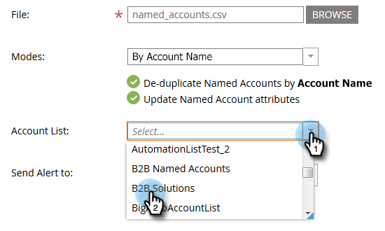

# 導入命名帳戶{#import-named-accounts}

已有充滿潛在目標帳戶的CSV嗎？ 直接匯入TAM!

1. 按一下&#x200B;**新建**&#x200B;下拉式清單並選擇&#x200B;**導入命名帳戶**。

   

1. 將會開啟新視窗。 按一下&#x200B;**瀏覽**，然後選取您要匯入之已命名帳戶的檔案。

   

   >[!TIP]
   >
   >在您的檔案中，請盡可能提供[資訊](/help/marketo/product-docs/target-account-management/target/named-accounts/named-account-overview.md#named-account-attributes)。 只能添加圖片資訊；Marketto不會計算任何內容（即Pipeline）。 若要根據CRM帳戶建立指名帳戶，只需將帳戶名稱和CRM ID從CRM匯出至CSV檔案、使用「帳戶名稱」選項，並在匯入程式中對應CRM ID。 若要將CRM帳戶正確連結至指名帳戶，您必須提供CRM帳戶的確切名稱。

1. 從兩種重複資料消除模式中選擇：帳戶名稱或網域名稱。 在此範例中，我們將選擇「帳戶」。 按一下&#x200B;**Modes**&#x200B;下拉式清單並選擇&#x200B;**By Account Name**。

   

   >[!NOTE]
   >
   >如果選擇&#x200B;**按域模式**，則必須同時包含命名帳戶和域欄位。

1. 若要選擇您指名的帳戶所新增至的帳戶清單，請按一下「帳戶清單」下拉式清單，然後進行選擇。****

   

   >[!NOTE]
   >
   >您也可以在下拉式方塊中輸入新的帳戶清單名稱，以建立全新的帳戶清單。

1. 若要傳送匯入通知，請按一下「傳送警報至&#x200B;**」下拉式清單，並選取Marketo使用者。**&#x200B;您&#x200B;_不能_&#x200B;手動輸入電子郵件地址。

   

1. 按一下&#x200B;**Next**。

   

1. 連按兩下「Marketo Field **」下拉式清單並選取適當的欄位，以映射每個欄位。**&#x200B;完成時，按一下「下一步」。****

   

   成功！

   

   >[!NOTE]
   >
   >「勾選匯入狀態」只會顯示最近三天的活動。

按帳戶名稱刪除重複資料的情況：

<table> 
 <tbody> 
  <tr> 
   <td><strong>導入具有現有命名帳戶名的記錄</strong></td> 
   <td>
我們將更新現有記錄
</td> 
  </tr> 
  <tr> 
   <td><strong>導入具有新命名帳戶名稱的記錄</strong></td> 
   <td>我們將建立新的記錄</td> 
  </tr> 
 </tbody> 
</table>

按域名刪除重複資料的情形：

<table> 
 <tbody> 
  <tr> 
   <td><strong>使用新帳戶名和新域名導入記錄</strong></td> 
   <td>我們將使用提供的資訊建立新的命名帳戶</td> 
  </tr> 
  <tr> 
   <td><strong>導入現有帳戶名和現有域名的記錄</strong></td> 
   <td>我們將更新現有的指名帳戶</td> 
  </tr> 
   <tr> 
   <td><strong>導入具有新帳戶名和現有域名的記錄</strong></td> 
   <td>我們將新帳戶名稱附加至符合網域名稱的現有命名帳戶，並更新其他資訊（例如產業、州等）</td> 
  </tr> 
  <tr> 
   <td><strong>導入具有現有命名帳戶名和新域名的記錄</strong></td> 
   <td>我們將新的網域名稱附加至符合帳戶名稱的現有命名帳戶，並更新其他資訊（例如產業、州等）</td> 
  </tr> 
 </tbody> 
</table>

>[!NOTE]
>
>當Market追加指名帳戶時，我們會更新規則（幕後），允許我們識別應屬於指名帳戶的人員。 範例：如果您將&quot;IBM&quot;更新為&quot;IBM, USA&quot;，則任何公司名稱的人員都會與命名帳戶關聯。

如果Marketo找到我們視為重複的記錄，我們只會處理第一個記錄。
