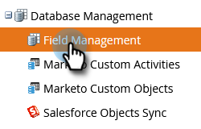

# 導致帳戶匹配 {#lead-to-account-matching}

使用Marketo銷售機會對帳戶比對，讓右側銷售機會對對指定帳戶。

>[!NOTE]
>
>**銷售機會帳戶** 符合Marketo Target帳戶管理的內建功能。它採用模糊邏輯，以近乎即時的方式自動匹配出正確的指定帳戶。 這些已命名帳戶可以是CRM帳戶或Marketo公司。

## 概述 {#overview}

Marketo銷售機會帳戶比對遵循4個步驟程式：

**步驟1 -** 我們的匹配流程從銷售機會記錄上的關鍵資訊開始，例如：

* 電子郵件網域（例如acme.com）
* 從IP位址推斷出的公司名稱
* 公司名稱 — 這可以是CRM帳戶名稱或潛在客戶公司名稱屬性（例如，來自表單填寫）

**步驟2 -** 我們根據各種銷售機會屬性（例如，Acme Inc.和Acme Corp會自動標準化為Acme）來標準化我們找到的公司名稱。此步驟可確保在Marketo中有指定帳戶的單一表示法，並可在單一指定帳戶中查看所有銷售機會。

**第3步 —** 我們將匹配的銷售機會分到2個儲存桶：強比和弱比。

* 弱匹配的銷售機會出現在已命名的帳戶上，然後可以手動解決。

**第4步 —** 我們列出了一個名單，列出了一些擬議中的公司，這些公司實力強弱。當根據其中一家建議的公司建立指定帳戶時，我們會建立相符規則，以自動將新銷售機會（例如，填寫表格的銷售機會）關聯至正確的指定帳戶。 這樣，您就不必擔心匹配的銷售機會，而更需要擔心獲得收入！

由於「Marketo銷售機會對帳戶」比對是「Marketo目標帳戶管理」的內建功能，因此比對銷售機會會以近乎即時的方式發生(例如，當銷售機會填寫Marketo表單時，我們會將該銷售機會與正確的指定帳戶建立關聯)。 此事件可用來觸發警報，並通知帳戶擁有者新銷售機會來自其指定帳戶。

>[!NOTE]
>
>如果您在Salesforce中使用LeanData進行銷售機會帳戶比對，Marketo的整合會將這些比對同步至您的Marketo執行個體。 若要啟用該功能，請聯繫[Marketo支援](https://nation.marketo.com/t5/Support/ct-p/Support)了解如何在下面設定LeanData。

## 使用LeanData進行銷售機會帳戶匹配 {#using-leandata-for-lead-to-account-matching}

在[Marketo支援](https://nation.marketo.com/t5/Support/ct-p/Support)為您的帳戶啟用LeanData後，請依照下列步驟進行設定。

1. 在Salesforce中，按一下左側導覽中的&#x200B;**設定首頁**。

1. 仍在左側導覽的「管理」下方，按一下「**使用者**」，然後按一下「**設定檔**」。

1. 找到並選取&#x200B;**Marketo同步**&#x200B;設定檔。

1. 向下捲動至「欄位層級安全性」區段，然後找出Lead物件。 選擇&#x200B;**View**。

1. 對於欄位名稱「Reporting Matched Account」，請確保選中&#x200B;**Read Access**&#x200B;列中的複選框。

1. 在Marketo中，前往&#x200B;**Admin**&#x200B;區段。

   

1. 選擇&#x200B;**欄位管理**。

   

1. 搜尋「報表符合的帳戶」以確認欄位存在。

   

>[!MORELIKETHIS]
[Discover帳戶](/help/marketo/product-docs/target-account-management/target/named-accounts/discover-accounts.md)>
>
