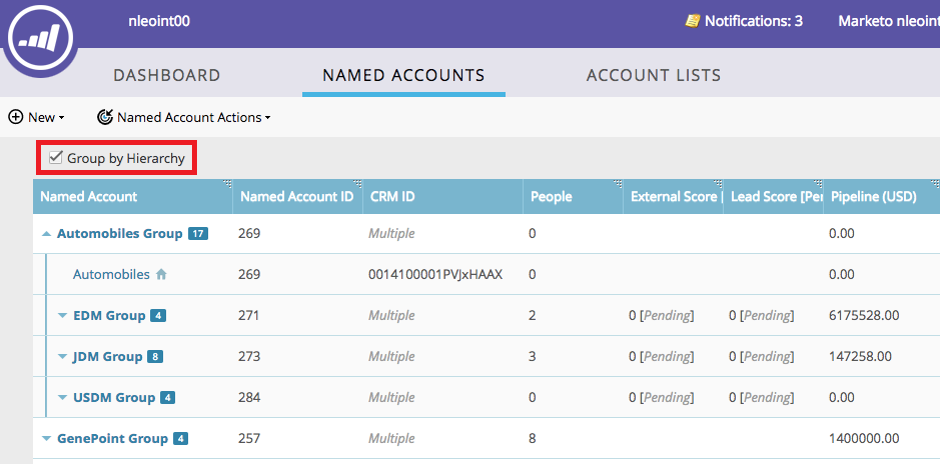
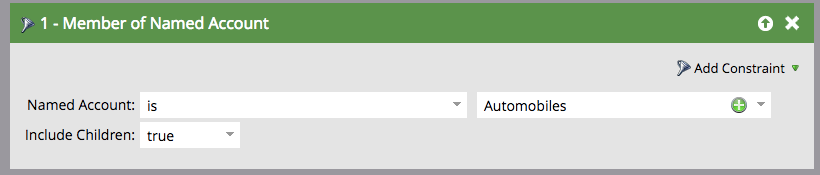

# TAM 階層 {#tam-hierarchies}

階層讓TAM使用者能夠繼承其CRM中[!UICONTROL Named Accounts]之間的父項/子項關係。

## 什麼是TAM階層？ {#what-are-tam-hierarchies}

公司可以有多個部門與子公司。 這些公司通常透過稱為階層的父子關係來組織自己。 TAM可從您的SFDC或MSD整合繼承這些階層，並可讓您以單一系列處理不同的部門。

## 使用TAM階層 {#working-with-tam-hierarchies}

使用TAM階層，您可以在[!UICONTROL Named Account]儀表板中快速取得整個階層或個別帳戶的相關資訊。

**未使用階層**

**使用階層**

>[!NOTE]
>
>Marketo介面最多只會顯示10個層級（父科目的子系與孫系科目），不過您可以建立的子系科目數目沒有限制。

按[一下](/help/marketo/product-docs/target-account-management/engage/account-filters.md#member-of-named-account)，即可鎖定整個階層的目標並製作報表。

