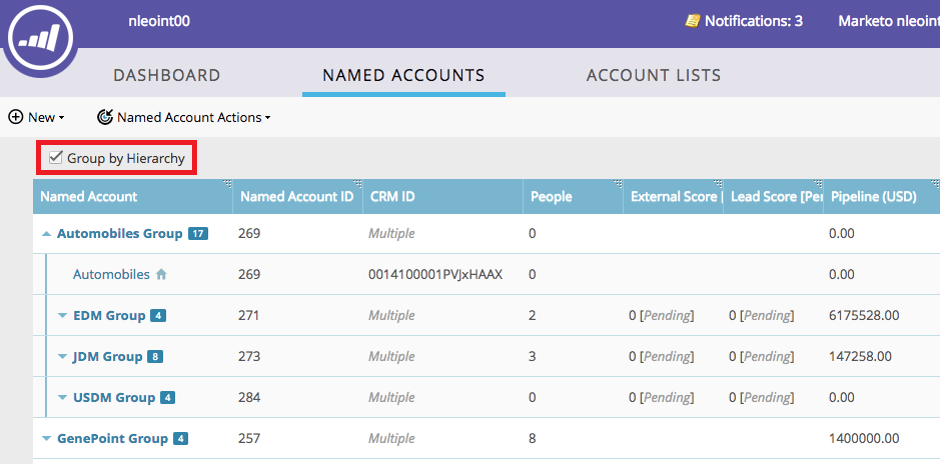

# TAM階層{#tam-hierarchies}

階層可讓TAM使用者在其CRM中繼承指名帳戶之間的父／子關係。

## 什麼是TAM階層？{#what-are-tam-hierarchies}

公司可以有多個部門和子公司。 這些公司通常通過稱為階層的父子關係來組織自己。 TAM可以從SFDC或MSD整合繼承這些層次結構，並允許您將不同的部門作為單個系列使用。

## 使用TAM層次{#working-with-tam-hierarchies}

使用TAM階層，您可以在「命名帳戶控制面板」中快速取得有關整個階層或個別帳戶的資訊。

**未使用階層**

**使用階層**

>[!NOTE]
>
>Marketo介面最多只會顯示10個層級（父帳戶的子帳戶和孫帳戶），但您可建立的子帳戶數目沒有限制。

只需按一下[，即可定位並報告整個階層。](/help/marketo/product-docs/target-account-management/engage/account-filters.md#member-of-named-account)

